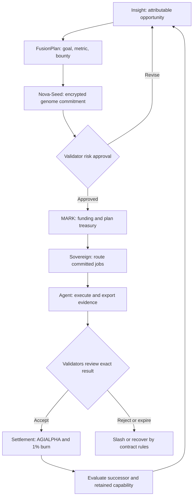
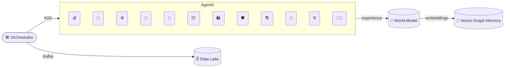
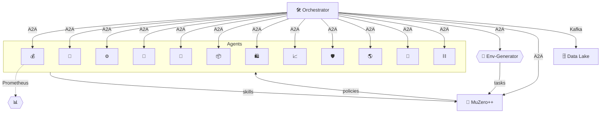
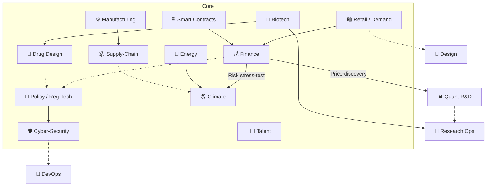
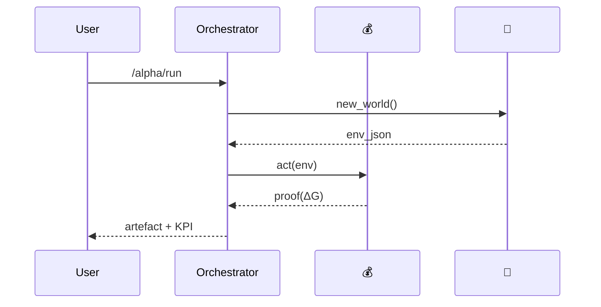
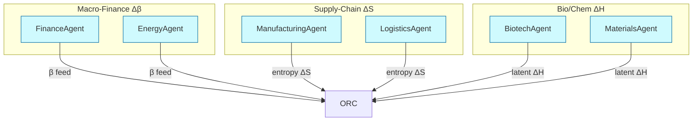

[See docs/DISCLAIMER_SNIPPET.md](../docs/DISCLAIMER_SNIPPET.md)
This repository is a conceptual research prototype. References to "AGI" and "superintelligence" describe aspirational goals and do not indicate the presence of a real general intelligence. Use at your own risk. Nothing herein constitutes financial advice. MontrealAI and the maintainers accept no liability for losses incurred from using this software.


# Alpha‑Factory v1 👁️✨ — Multi‑Agent **AGENTIC** α‑AGI

**Version 1.13.0 · maintained Python package and full architecture.**

[Start here](../docs/agent/START_HERE.md) · [Factory guide](../docs/agent/FACTORY_GUIDE.md) · [Operator guide](../docs/agent/OPERATIONS.md)
· [Live workspace](https://montrealai.github.io/AGI-Alpha-Agent-v0/)
· [Ascension protocol](../docs/agent/ASCENSION_PROTOCOL.md) · [All 26 catalog entries](demos/README.md)
· [Demo walkthrough and prerequisite checks](../docs/agent/DEMOS.md)

Alpha-Factory connects opportunity analysis, bounded mission execution, review, retained evidence and
validator-gated enterprise funding. The architecture and original flowcharts below remain intact.
Choose the execution profile that matches your goal:

| I want to… | Start here | What actually runs |
|---|---|---|
| Try a useful decision immediately | [Decision Studio](https://montrealai.github.io/AGI-Alpha-Agent-v0/studio/) | Editable scenarios, checked calculations and downloadable dossiers |
| Run my own research, allocation, schedule or forecast | `alpha-factory mission --help` | Persistent native engine, signed journal, independent arithmetic checks, operator review |
| Generate or evaluate code | [Code configuration](../docs/agent/OPERATIONS.md#configure-inference-and-code) | Explicitly enabled Docker execution with resource/network limits |
| Compile a venture plan and hand off reviewed work | `alpha-factory mission ascension-compile --help` | Exact Solidity-compatible Merkle commitments and signed delivery files |
| Inspect funding, jobs, validators and burn accounting | [Protocol Desk](https://montrealai.github.io/AGI-Alpha-Agent-v0/ascension-protocol/) | Recorded local-EVM transactions; editable exact calculators |
| Measure capability transfer before promotion | [Compounding Lab](https://montrealai.github.io/AGI-Alpha-Agent-v0/compounding/) | Held-out tasks, controls, cost accounting and replayable evidence |
| Explore the original multi-agent experiments | `alpha-factory demos list` | All preserved demos, each with its mode, prerequisites and limits |

**Operating scope.** The maintained deployment profile is a private, single-operator runtime. The
Ascension contracts are a tested, undeployed reference protocol. The domain-agent constellation, world
models, industry integrations and federation below include research implementations and optional
services. No installation alone establishes general intelligence, real-world profitability, independent
validators, regulatory compliance or readiness for unattended mainnet operation.


```mermaid
flowchart TD
    I["Insight: attributable opportunity"] --> P["FusionPlan: goal, metric, bounty"]
    P --> N["Nova-Seed: encrypted genome commitment"]
    N --> G{"Validator risk approval"}
    G -->|Approved| M["MARK: funding and plan treasury"]
    G -->|Revise| I
    M --> J["Sovereign: route committed jobs"]
    J --> A["Agent: execute and export evidence"]
    A --> V{"Validators review exact result"}
    V -->|Accept| S["Settlement: AGIALPHA and 1% burn"]
    V -->|Reject or expire| R["Slash or recover by contract rules"]
    S --> E["Evaluate successor and retained capability"]
    E --> I
```

The [factory guide](../docs/agent/FACTORY_GUIDE.md) maps each stage to code, commands and evidence.
Local operator review and an Ed25519 signature are distinct from ENS admission and on-chain votes.


**Out‑learn · Out‑think · Out‑design · Out‑strategise · Out‑execute**

---

> **Mission 🎯**  Identify 🔍 → Learn 📚 → Think 🧠 → Design 🎨 → Strategise ♟️ → Execute ⚡ — compounding real‑world **α** across *all* industries.

Global markets seep *USD ✧ trillions/yr* in latent opportunity — “alpha” in the broadest sense:  
<kbd>pricing dislocations • supply‑chain entropy • novel drug targets • policy loopholes • undiscovered materials</kbd>.

**The Alpha‑Factory v1 vision** is an antifragile constellation of self‑improving Agentic α‑AGI Agents 👁️✨ orchestrated to **spot live alpha across any industry and transmute it into compounding value**.

**Definition**: An **α‑AGI Business** 👁️✨ is an on‑chain autonomous enterprise (`<name>.alpha.agi.eth`) that unleashes a swarm of self‑improving agentic **α‑AGI agents** 👁️✨ (`<name>.alpha.agent.agi.eth`) to hunt down inefficiencies across any domain and transmute them into **$AGIALPHA**.

Research integrations include **OpenAI Agents SDK**, **Google ADK**, **A2A protocol**, and Anthropic’s **Model Context Protocol**, with separately configured cloud or local models. The maintained runtime needs none of these optional SDKs for its four non-code mission types.

## Disclaimer
This repository is a conceptual research prototype. References to "AGI" and
"superintelligence" describe aspirational goals and do not indicate the presence
of a real general intelligence. Use at your own risk.

---

## 📜 Table of Contents
0. [Design Philosophy](#0-design-philosophy)  
1. [System Topology 🗺️](#1-system-topology)  
2. [World‑Model & Planner 🌌](#2-world-model--planner)  
3. [Agent Gallery 🖼️ (12 agents)](#3-agent-gallery)  
4. [Demo Showcase 🎬 (12 demos)](#4-demo-showcase)  
5. [Memory & Knowledge Fabric 🧠](#5-memory--knowledge-fabric)  
6. [5‑Minute Quick‑Start 🚀](#6-5-minute-quick-start)  
7. [Deployment Recipes 🍳](#7-deployment-recipes)  
8. [Governance & Compliance ⚖️](#8-governance--compliance)  
9. [Observability 🔭](#9-observability)  
10. [Extending the Mesh 🔌](#10-extending-the-mesh)  
11. [Troubleshooting 🛠️](#11-troubleshooting)  
12. [Roadmap 🛣️](#12-roadmap)  
13. [Credits 🌟](#13-credits)  

---

<a name="0-design-philosophy"></a>
## 0 · Design Philosophy

> “We have shifted from *big‑data hoarding* to **big‑experience compounding**.” — *Era of Experience*.

* **Experience‑First Loop** — Sense → *Imagine* (MuZero‑style latent planning) → Act → Adapt.  
* **AI‑GA Autogenesis** — The factory meta‑evolves new agents and curricula inspired by Clune’s *AI‑Generating Algorithms*.  
* **Graceful Degradation** — GPU‑less? No cloud key? Agents fall back to distilled local models & heuristics.  
* **Zero‑Trust Design** — signed artefacts and audit logs in the native runtime; SPIFFE and additional guards are deployment-specific architecture targets.
* **Explicit Value Units** — keep measured task units, modeled benefit, token amounts and realized revenue separate; the architecture explores a common *alpha Δ∑USD* lens.

---

<a name="1-system-topology"></a>
## 1 · System Topology 🗺️

```mermaid
flowchart LR
  ORC([🛠️ Orchestrator])
  WM[(🌌 World‑Model)]
  MEM[(🔗 Vector‑Graph Memory)]
  subgraph Agents
    FIN(💰)
    BIO(🧬)
    MFG(⚙️)
    POL(📜)
    ENE(🔋)
    SUP(📦)
    RET(🛍️)
    CYB(🛡️)
    CLM(🌎)
    DRG(💊)
    SCT(⛓️)
    TAL(🧑‍💻)
  end
  ORC -- A2A --> Agents
  Agents -- experience --> WM
  WM -- embeddings --> MEM
  ORC -- Kafka --> DL[(🗄️ Data Lake)]
```

* **Orchestrator** auto‑discovers agents (see `backend/agents/__init__.py`) and exposes a unified REST + gRPC facade.  
* **World‑Model** uses MuZero‑style latent dynamics for counterfactual planning.  
* **Memory Fabric** = pgvector + Neo4j for dense & causal recall.

---

<a name="2-world-model--planner"></a>
## 2 · World‑Model & Planner 🌌

| Component | Source Tech | Role |
|-----------|-------------|------|
| **Latent Dynamics** | MuZero++ | Predict env transitions & value |
| **Self‑Play Curriculum** | POET‑XL | Generates alpha‑labyrinth tasks |
| **Meta‑Gradient** | AI‑GA | Evolves optimiser hyper‑nets |
| **Task Selector** | Multi‑Armed Bandit | Schedules agent ↔ world‑model interactions |

---

<a name="3-agent-gallery"></a>
## 3 · Agent Gallery 🖼️


```mermaid
flowchart TD
    ORC["🛠️ Orchestrator"]
    GEN{{"🧪 Env‑Generator"}}
    LRN["🧠 MuZero++"]

    subgraph Agents
        FIN["💰"]
        BIO["🧬"]
        MFG["⚙️"]
        POL["📜"]
        ENE["🔋"]
        SUP["📦"]
        RET["🛍️"]
        MKT["📈"]
        CYB["🛡️"]
        CLM["🌎"]
        DRG["💊"]
        SMT["⛓️"]
    end

    %% message flows
    GEN -- tasks --> LRN
    LRN -- policies --> Agents
    Agents -- skills --> LRN

    ORC -- A2A --> FIN
    ORC -- A2A --> BIO
    ORC -- A2A --> MFG
    ORC -- A2A --> POL
    ORC -- A2A --> ENE
    ORC -- A2A --> SUP
    ORC -- A2A --> RET
    ORC -- A2A --> MKT
    ORC -- A2A --> CYB
    ORC -- A2A --> CLM
    ORC -- A2A --> DRG
    ORC -- A2A --> SMT
    ORC -- A2A --> GEN
    ORC -- A2A --> LRN

    ORC -- Kafka --> DATALAKE["🗄️ Data Lake"]
    FIN -.->|Prometheus| GRAFANA{{"📊"}}
```

| # | Agent | Path | Prime Directive | Research maturity (historical) | Key Env Vars |
|---|-------|------|-----------------|--------|--------------|
| 1 | **Finance** 💰 | `finance_agent.py` | Multi‑factor alpha & RL execution | Research integration | `BROKER_DSN` |
| 2 | **Biotech** 🧬 | `biotech_agent.py` | CRISPR & assay proposals | Research integration | `OPENAI_API_KEY` |
| 3 | **Manufacturing** ⚙️ | `manufacturing_agent.py` | CP‑SAT optimiser | Research integration | `SCHED_HORIZON` |
| 4 | **Policy** 📜 | `policy_agent.py` | Statute QA & diffs | Research integration | `STATUTE_CORPUS_DIR` |
| 5 | **Energy** 🔋 | `energy_agent.py` | Spot‑vs‑forward arbitrage | Experimental | `ISO_TOKEN` |
| 6 | **Supply‑Chain** 📦 | `supply_chain_agent.py` | Stochastic MILP routing | Experimental | `SC_DB_DSN` |
| 7 | **Retail Demand** 🛍️ | `retail_demand_agent.py` | SKU forecast & pricing | Experimental | `POS_DB_DSN` |
| 8 | **Cyber‑Sec** 🛡️ | `cyber_threat_agent.py` | Predict & patch CVEs | Experimental | `VT_API_KEY` |
| 9 | **Climate Risk** 🌎 | `climate_risk_agent.py` | ESG stress tests | Experimental | `NOAA_TOKEN` |
|10 | **Drug‑Design** 💊 | `drug_design_agent.py` | Diffusion + docking | Incubation | `CHEMBL_KEY` |
|11 | **Smart‑Contract** ⛓️ | `smart_contract_agent.py` | Formal verification | Incubation | `ETH_RPC_URL` |
|12 | **Talent‑Match** 🧑‍💻 | `talent_match_agent.py` | Auto‑bounty hiring | Incubation | — |


```mermaid
%% Legend
%%  solid arrows  = primary value‑flow
%%  dashed arrows = secondary / supporting influence
%%  node emojis   = domain archetypes

graph TD
    %% Core pillars
    FIN["💰 Finance"]
    BIO["🧬 Biotech"]
    MFG["⚙️ Manufacturing"]
    POL["📜 Policy / Reg‑Tech"]
    ENE["🔋 Energy"]
    SUP["📦 Supply‑Chain"]
    RET["🛍️ Retail / Demand"]
    CYB["🛡️ Cyber‑Security"]
    CLM["🌎 Climate"]
    DRG["💊 Drug Design"]
    SMT["⛓️ Smart Contracts"]
    TLT["🧑‍💼 Talent"]

    %% Derived transversal competences
    QNT["📊 Quant R&D"]
    RES["🔬 Research Ops"]
    DSG["🎨 Design"]
    OPS["🔧 DevOps"]

    %% Primary value‑creation arcs
    FIN -->|Price discovery| QNT
    FIN -->|Risk stress‑test| CLM
    BIO --> DRG
    BIO --> RES
    MFG --> SUP
    ENE --> CLM
    RET --> FIN
    POL --> CYB
    SMT --> FIN

    %% Cross‑pollination (secondary, dashed)
    FIN -.-> POL
    SUP -.-> CLM
    CYB -.-> OPS
    DRG -.-> POL
    QNT -.-> RES
    RET -.-> DSG

    %% Visual grouping
    subgraph Core
        FIN
        BIO
        MFG
        POL
        ENE
        SUP
        RET
        CYB
        CLM
        DRG
        SMT
        TLT
    end
    classDef core fill:#0d9488,color:#ffffff,stroke-width:0px;
```

Each agent exports a signed *proof‑of‑alpha* message to the Kafka bus, enabling cross‑breeding of opportunities.


```mermaid
sequenceDiagram
    participant User
    participant ORC as Orchestrator
    participant FIN as 💰
    participant GEN as 🧪
    User->>ORC: /alpha/run
    ORC->>GEN: new_world()
    GEN-->>ORC: env_json
    ORC->>FIN: act(env)
    FIN-->>ORC: proof(ΔG)
    ORC-->>User: artefact + KPI
```

---

<a name="4-demo-showcase"></a>
## 4 · Demo Showcase 🎬

| # | Folder | Emoji | Lightning Pitch | Alpha Contribution | Start Locally |
|---|--------|-------|-----------------|--------------------|---------------|
|1|`aiga_meta_evolution`|🧬|Agents *evolve* new agents; genetic tests auto‑score fitness.|Expands strategy space, surfacing fringe alpha.|`alpha-factory demos show aiga_meta_evolution`|
|2|`alpha_agi_business_v1`|🏦|Ranks bundled business opportunities; illustrates a company workflow.|Shows idea → proposal; does not legally register a business.|`alpha-factory demos show alpha_agi_business_v1`|
|3|`alpha_agi_business_2_v1`|🏗|Runs a local business-agent service with optional provider commentary.|Continuous adaptation → durable competitive alpha.|`alpha-factory demos show alpha_agi_business_2_v1`|
|4|`alpha_agi_business_3_v1`|📊|Runs a bounded business-cycle simulation with local fallback results.|Optimises capital stack for ROI alpha.|`alpha-factory demos show alpha_agi_business_3_v1`|
|5|`alpha_agi_marketplace_v1`|🛒|Peer‑to‑peer agent marketplace simulating price discovery.|Validates micro‑alpha extraction via agent barter.|`alpha-factory demos show alpha_agi_marketplace_v1`|
|6|`alpha_asi_world_model`|🌌|Scales MuZero‑style world‑model to an open‑ended grid‑world.|Stress‑tests anticipatory planning for ASI scenarios.|`alpha-factory demos show alpha_asi_world_model`|
|7|`cross_industry_alpha_factory`|🌐|Full pipeline: ingest → plan → act across 4 verticals.|Proof that one orchestrator handles multi‑domain alpha.|`alpha-factory demos show cross_industry_alpha_factory`|
|8|`era_of_experience`|🏛|Lifelong RL stack blending real & synthetic experience streams.|Showcases sensor-motor tools, grounded rewards & non-human reasoning.|`alpha-factory demos show era_of_experience`|
|9|`finance_alpha`|💹|Paper-market and legacy broker integration example.|Illustrates risk controls; realized P&L is not established by release evidence.|`alpha-factory demos show finance_alpha`|
|10|`macro_sentinel`|🌐|Monte Carlo risk simulation over bundled macro inputs.|Quantifies modeled tail risk under supplied assumptions.|`alpha-factory demos show macro_sentinel`|
|11|`muzero_planning`|♟|MuZero in 60 s; online world‑model with MCTS.|Distills planning research into a one‑command demo.|`alpha-factory demos show muzero_planning`|
|12|`self_healing_repo`|🩹|Repo-Healer v1 runs bounded triage + targeted repair for this repo.|Maintains pipeline uptime alpha.|`alpha-factory demos show self_healing_repo`|

> **Colab?** Some demos include notebooks. Check each catalog entry for its actual assets, dependencies and execution mode.

### Demo execution modes

The [catalog](demos/README.md) is the maintained launch inventory; these are the original showcase entries.
| Demo | Purpose | Stability |
|------|---------|-----------|
|[aiga_meta_evolution](demos/aiga_meta_evolution/README.md)|Small-network evolution|Research training|
|[alpha_agi_business_v1](demos/alpha_agi_business_v1/README.md)|Bundled opportunity-ranking sample|Offline sample|
|[alpha_agi_business_2_v1](demos/alpha_agi_business_2_v1/README.md)|Business-agent orchestration|Local service|
|[alpha_agi_business_3_v1](demos/alpha_agi_business_3_v1/README.md)|Bounded business cycle|Simulation|
|[alpha_agi_marketplace_v1](demos/alpha_agi_marketplace_v1/README.md)|Bundled job validation and API client|Local API client|
|[alpha_asi_world_model](demos/alpha_asi_world_model/README.md)|Generated grid-world training|Research training|
|[cross_industry_alpha_factory](demos/cross_industry_alpha_factory/README.md)|Bundled cross-industry opportunities|Offline sample|
|[era_of_experience](demos/era_of_experience/README.md)|Signals from bundled CSV history|Offline sample|
|[finance_alpha](demos/finance_alpha/README.md)|Paper-market broker example|Deployment example|
|[macro_sentinel](demos/macro_sentinel/README.md)|Monte Carlo macro-risk model|Offline simulation|
|[muzero_planning](demos/muzero_planning/README.md)|Small MuZero-style planner|Research planning|
|[self_healing_repo](demos/self_healing_repo/README.md)|Bounded Repo-Healer v1 for Tier-1 CI failures + structured diagnosis|Beta|
|[meta_agentic_tree_search_v0](demos/meta_agentic_tree_search_v0/README.md)|Integer-policy search|Offline simulation|
|[alpha_agi_insight_v0](demos/alpha_agi_insight_v0/README.md)|Toy sector-score search|Offline simulation|

### 4.1 · [α-ASI World-Model Demo 👁️✨](https://github.com/MontrealAI/AGI-Alpha-Agent-v0/tree/main/alpha_factory_v1/demos/alpha_asi_world_model)

Paper: [Multi-Agent AGENTIC α-AGI World-Model Demo 🥑](https://github.com/MontrealAI/AGI-Alpha-Agent-v0/blob/main/alpha_factory_v1/demos/alpha_asi_world_model/Alpha_ASI_World_Model.pdf)

```
┌──────────────────────────────── Alpha-Factory Bus (A2A) ───────────────────────────────┐
│                                                                                        │
│   ┌──────────────┐   curriculum   ┌───────────┐   telemetry   ┌────────────┐          │
│   │ StrategyAgent│───────────────►│ Orchestr. │──────────────►│   UI / WS  │          │
│   └──────────────┘                │  (loop)   │◄──────────────│  Interface │          │
│          ▲  ▲                     └───────────┘    commands   └────────────┘          │
│          │  │ new_env/reward                     ▲                                   │
│   plans  │  │ loss stats                        │ halt                              │
│          │  └──────────────────────┐            │                                   │
│   ┌──────┴───────┐   context       │            │                                   │
│   │ ResearchAgent│───────────────► Learner (MuZero) ◄─ SafetyAgent (loss guard)      │
│   └──────────────┘                │   ▲                                             │
│              code patches         │   │                                             │
│   ┌──────────────┐                │   │ gradients                                   │
│   │ CodeGenAgent │────────────────┘   │                                             │
│   └──────────────┘                    │                                             │
│                                       ▼                                             │
│                            POET Generator → MiniWorlds (env pool)                    │
└────────────────────────────────────────────────────────────────────────────────────────┘
```

### 4.2 · [🏛️ Large‑Scale α‑AGI Business 3 Demo 👁️✨ — **Omega‑Grade Edition**](https://github.com/MontrealAI/AGI-Alpha-Agent-v0/tree/main/alpha_factory_v1/demos/alpha_agi_business_3_v1)

> **Alpha‑Factory v1 → Ω‑Lattice v0**  
> _Transmuting cosmological free‑energy gradients into compounding cash‑flows._

Multi‑Scale Energy‑Landscape Diagram:


```mermaid
flowchart TB
  subgraph Macro["Macro‑Finance Δβ"]
    FIN[FinanceAgent]:::agent
    ENE[EnergyAgent]:::agent
  end
  subgraph Meso["Supply‑Chain ΔS"]
    MFG[ManufacturingAgent]:::agent
    LOG[LogisticsAgent]:::agent
  end
  subgraph Micro["Bio/Chem ΔH"]
    BIO[BiotechAgent]:::agent
    MAT[MaterialsAgent]:::agent
  end
  FIN & ENE -->|β feed| ORC
  MFG & LOG -->|entropy ΔS| ORC
  BIO & MAT -->|latent ΔH| ORC
  classDef agent fill:#cffafe,stroke:#0369a1;
```

Cells with \(Δ\mathcal F < 0\) glow 🔵 on Grafana; Ω‑Agents race to harvest.

---

<a name="5-memory--knowledge-fabric"></a>
## 5 · Memory & Knowledge Fabric 🧠

```
[Event] --embedding--> PGVector DB
                   \--edge--> Neo4j (CAUSES, SUPPORTS, RISK_OF)
```

* Agents query `mem.search("supply shock beta>0.2")`  
* Planner asks Neo4j: `MATCH (a)-[:CAUSES]->(b) WHERE b.delta_alpha > 5e6 RETURN path`

---

<a name="6-5-minute-quick-start"></a>
## 6 · 5-Minute Quick-Start 🚀

From the repository root, use Python 3.11–3.13 in a dedicated virtual environment.
The examples also ship inside the wheel, so an installed agent works from any directory.

```bash
git clone https://github.com/MontrealAI/AGI-Alpha-Agent-v0.git
cd AGI-Alpha-Agent-v0
python3 -m venv .venv-agent
source .venv-agent/bin/activate
python -m pip install --require-hashes -r requirements-agent.lock
python -m pip install --no-deps -e .
python -m alpha_factory_v1.scripts.preflight --profile agent --offline
alpha-factory mission examples --output my-missions
alpha-factory mission --home ./agent-state init
alpha-factory mission --home ./agent-state run my-missions/allocation.json
alpha-factory mission --home ./agent-state serve
```

Open **http://127.0.0.1:8765**, read the access token from `agent-state/api.token`, and
inspect the result before approving or rejecting it. Stop the server with **Ctrl+C**.
Existing mission/example directories are never overwritten. No cloud key or GPU is required.
For Windows, use `python -m venv .venv-agent` and `.venv-agent\Scripts\Activate.ps1`.

Research without a configured provider extracts source passages. It does not silently pretend to run
an LLM. Allocation, scheduling and forecasting use local algorithms. Configure models, Docker and
payment verification explicitly in the [operator guide](../docs/agent/OPERATIONS.md).

The preserved source launcher now supports `--profile agent` and `--profile legacy` (the historical
default). `python alpha_factory_v1/quickstart.py --profile agent --preflight --offline` only checks;
it never installs packages or creates a home. `--wheelhouse PATH` enables local-only installation.
The [factory guide](../docs/agent/FACTORY_GUIDE.md) includes exact source, wheel, offline and recovery paths.

---

<a name="7-deployment-recipes"></a>
## 7 · Deployment Recipes 🍳

Run paths below from the repository root. The native profile is qualified for a private operator host;
the broader research stack and cloud charts need their own configuration and commissioning.

| Target | Existing entry point | Scope |
|---|---|---|
| **Private operator** | `alpha-agent --home ./agent-state serve` | Authenticated loopback console; signed state and recovery |
| **Operator container** | `docker build --target agent-runtime -t agialpha-agent:1.13.0 -f alpha_factory_v1/Dockerfile .` | [Persistent volume and upgrade commands](../docs/agent/OPERATIONS.md) |
| **Research Compose** | `docker compose -f alpha_factory_v1/docker-compose.yml config` | Inspect configuration first; supply a separate `.env` and deployment-specific services |
| **Helm (K8s)** | `helm lint alpha_factory_v1/helm/alpha-factory` | Preserved chart; review values, secrets, images and exposure before installing |
| **AWS Fargate** | Architecture target | No `infra/deploy_fargate.sh` is shipped; do not run the old proposed command |
| **Edge / offline** | `python edge_runner.py --help` | Preserved research runner; no automatic hardware-performance guarantee |

---

<a name="8-governance--compliance"></a>
## 8 · Governance & Compliance ⚖️

* **MCP envelopes** (SHA‑256, ISO‑8601, policy hash)  
* **Adversarial checks** exercise tampering, malformed input, permissions, deadlines and recovery; broader prompt/action fuzzing remains an extension target.
* **Attestation design** — historical W3C credential hooks are optional. Native mission receipts use Ed25519; Ascension uses independent on-chain role and vote checks.

---

<a name="9-observability"></a>
## 9 · Observability 🔭

| Signal | Sink | Example |
|--------|------|---------|
| Metrics | Prometheus | Inspect the enabled service metrics; financial values need an actual data source |
| Traces | OpenTelemetry | `trace_id` |
| Dashboards | Grafana | `docs/grafana/dashboards/alpha_factory_overview.json` |
| Config | `docs/prometheus.yml` | Prometheus & Grafana defaults |

Docker Compose mounts `docs/prometheus.yml` and the Grafana provisioning files
so metrics are available out-of-the-box.

---

<a name="10-extending-the-mesh"></a>
## 10 · Extending the Mesh 🔌
```python
from alpha_factory_v1.backend.agents.base import AgentBase

class MySuperAgent(AgentBase):
    NAME = "super"
    CAPABILITIES = ["telemetry_fusion"]
    COMPLIANCE_TAGS = ["gdpr_minimal"]

    async def step(self):
        ...

```

```toml
[project.entry-points."alpha_factory.agents"]
super = "my_pkg.super_agent:MySuperAgent"
```
Install a trusted plugin in the research environment and restart to discover it. Signed wheel loading is separately configured; see the [contributor guide](../AGENTS.md#wheel-signing). This plugin API does not change the five native mission schemas.

---

<a name="11-troubleshooting"></a>
## 11 · Troubleshooting 🛠️

| Symptom | Cause | Fix |
|---------|-------|-----|
| `ImportError: faiss` | FAISS missing | `pip install faiss-cpu` |
| Agent quarantined | exceptions | Check logs, clear flag |
| Kafka refuse | broker down | unset `ALPHA_KAFKA_BROKER` |

---

### Running Tests

Use the helper script below to execute the full test-suite. It automatically
falls back to Python's built-in `unittest` discovery when `pytest` is not
available.

```bash
python -m alpha_factory_v1.scripts.run_tests
```
---

<a name="12-roadmap"></a>
## 12 · Roadmap 🛣️

1. **RL‑on‑Execution** — slippage‑aware order routing  
2. **Federated Mesh** — cross‑org agent exchange via ADK federation  
3. **World‑Model Audits** — interpretable probes of latents  
4. **Industry Packs** — Health‑Care, Gov‑Tech  
5. **Provable Safety ℙ** — Coq proofs for Actuators  

---

<a name="13-credits"></a>
## 13 · Credits 🌟

[Vincent Boucher](https://www.linkedin.com/in/montrealai/)—pioneer in AI and President of [MONTREAL.AI](https://www.montreal.ai/) since 2003—dominated the [OpenAI Gym](https://web.archive.org/web/20170929214241/https://gym.openai.com/read-only.html) with **AI Agents** in 2016 and unveiled the seminal [**“Multi‑Agent AI DAO”**](https://www.quebecartificialintelligence.com/priorart) in 2017.

Our **AGI ALPHA AGENT**, fuelled by the strictly‑utility **$AGIALPHA** token, now taps that foundation to unleash the ultimate α‑signal engine.

---

*Made with ❤️ by the Alpha‑Factory Agentic Core Team — forging the tools that forge tomorrow.*
