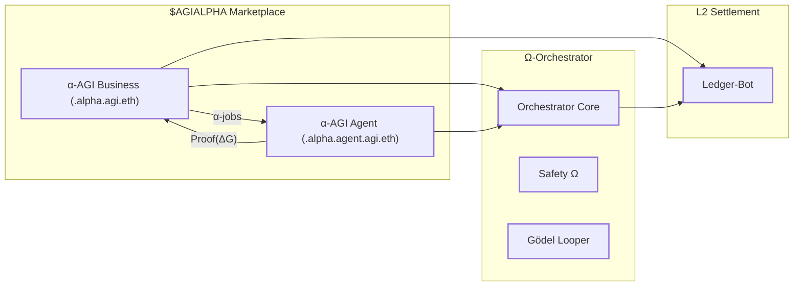
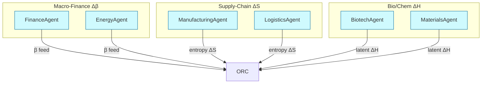
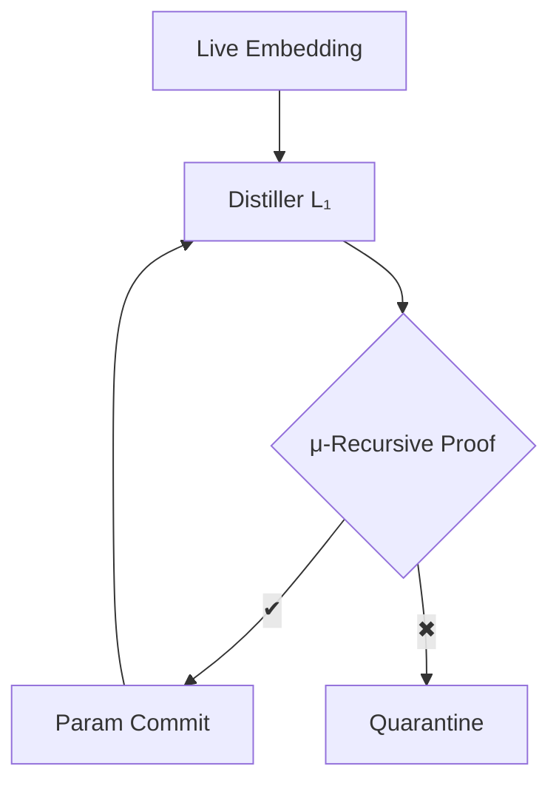

[See docs/DISCLAIMER_SNIPPET.md](../../../docs/DISCLAIMER_SNIPPET.md)

# 🏛️ Large-Scale α-AGI Business 3 👁️✨ — Ω-Lattice Enterprise Studio

<!-- CURRENT-DEMO:START -->
## Current runnable path — 1.23.3

**Mode:** Reproducible planning. Select a constrained enterprise portfolio, stress the downside,
and export reviewable Ascension jobs.

**Prerequisites:** Python 3.11–3.13. The planner uses only the standard library; the browser needs no account,
wallet or API key. The installed operator environment also provides FusionPlan compilation.

```bash
python -m alpha_factory_v1.demos check alpha_agi_business_3_v1
python -m alpha_factory_v1.demos run alpha_agi_business_3_v1 --output-dir my-business-runs
```

**Expected result:** Seven retained evidence files, an exact portfolio comparison, and unsubmitted
jobs with a goal, success metric and $AGIALPHA bounty.

**Scope:** Built-in inputs are constructed assumptions. Calculations do not approve investments,
change model weights, mint seeds or submit transactions. Independent review remains necessary.
<!-- CURRENT-DEMO:END -->

**[Open Enterprise Studio](https://montrealai.github.io/AGI-Alpha-Agent-v0/alpha_agi_business_3_v1/)** ·
[Full demo walkthrough](../../../docs/agent/DEMOS.md) ·
[Ascension protocol](../../../docs/agent/ASCENSION_PROTOCOL.md) ·
[Original research archive](RESEARCH_ARCHIVE.md)

## Obtain a useful first result

1. Open Enterprise Studio and choose **An enterprise transformation portfolio**.
2. Review the 12 candidate ventures across nine sectors. Expand a venture to edit its costs,
   annual net operating cash flows, staff effort, evidence score, review time and job bounty.
3. Set your capital ceiling, staffing, independent-review capacity and separate AGIALPHA job budget.
   Choose downside assumptions and an evidence threshold.
4. Select **Calculate the portfolio**. Compare the exact selection with the greedy baseline,
   inspect the adverse scenarios, and review every proposed job's success metric.
5. Download the **evidence bundle**. Import its `dossier.json` here or verify it with Python.

The five built-in cases deliberately expose different decisions:

| Case | What changes | What to inspect |
|---|---|---|
| `industrial` | USD 1.2M, 500 staff days, 400 review minutes | Exact allocation and opportunity cost versus greedy ranking |
| `lean-budget` | USD 600,000 capital ceiling | Which smaller ventures jointly fit the budget |
| `review-bottleneck` | Only 150 independent-review minutes | Fewer admitted ventures even when capital remains |
| `severe-downside` | 50% adverse cash-flow shock; 25% capital overrun | A hold decision with zero jobs when no positive-value plan qualifies |
| `evidence-first` | 85% supplied evidence threshold | Rejection of attractive but insufficiently supported inputs |

These are constructed planning cases, not market data or measured returns. Evidence scores are supplied
screening assumptions, not validator votes. Use public, licensed or constructed source records for your own cases.

## Run locally or from the release wheel

Use the [release installer](../../../docs/agent/START_HERE.md) for a complete operator environment.
From a source checkout, the default planner requires only Python 3.11–3.13 and runs from the repository root:

```bash
python -m alpha_factory_v1.demos.alpha_agi_business_3_v1 --list
python -m alpha_factory_v1.demos.alpha_agi_business_3_v1 --case industrial --output my-business-runs
```

The installed console command is equivalent:

```bash
alpha-agi-business-3-v1 --case industrial --output my-business-runs
```

On Windows, run the same commands in PowerShell using the Python environment you installed.
Quote paths that contain spaces. The CLI prints the exact verification and FusionPlan commands for its output.

To use your own assumptions, edit the exported `scenario.json`, preserve its schema and provenance fields,
and run:

```bash
python -m alpha_factory_v1.demos.alpha_agi_business_3_v1 --input scenario.json --output revised-business-runs
python -m alpha_factory_v1.demos.alpha_agi_business_3_v1 --verify path/to/dossier.json
```

`--json` prints the full machine-readable dossier. `--verify` recomputes all decisions and jobs without
creating output files. It rejects a forged result even when its author recalculates its SHA-256 hash.
A hash establishes content integrity, not the truth of its inputs or the identity of a reviewer.

### Keep and recover your work

Each CLI run creates a directory named by the complete dossier hash. Running identical inputs verifies and
reuses identical files; changed inputs create a separate directory. Existing or partial work is never overwritten.
If a run was interrupted or an output was edited, retain it and choose a different output directory.

The browser offers explicit **Save draft locally**, **Restore draft** and **Clear saved draft** controls.
Only this workspace's saved draft is cleared. Device storage can be unavailable; calculation and downloads
still work. Export files for portable backups. After the site has fully loaded once and its offline cache is ready,
the workspace can recalculate offline. A first visit requires access to the hosted assets.

| File | Purpose |
|---|---|
| `scenario.json` | Normalized inputs, provenance, assumptions and constraints |
| `dossier.json` | Complete decisions, alternatives, role analysis, jobs and SHA-256 commitment |
| `decision-brief.md` | Readable decision, resource reservations, methods and review requirements |
| `selected-projects.csv` | Selected project capital, NPV, staffing, review time and bounties |
| `jobs.json` | Exact ordered specifications accepted by `alpha-agent ascension-compile` |
| `seed-draft.json` | Dossier/job content commitments; explicitly unminted and unencrypted |
| `SHA256SUMS` | Hashes of the other six files |

## Read the decision visuals and research collection

After calculation, **See what earns a place** compares every candidate's expected and policy-downside NPV
on one common scale, including negative values. Each row identifies selection or insufficient evidence and
prints both exact USD amounts. Standalone value does not override portfolio constraints or dependencies.
Changing inputs clears the result until you recalculate.

The **Research collection** retains the original artwork at a compact size, with direct access to the
flowcharts, founding research and capital-committee workspace. The original synthetic replay remains available
with explicit unitless axes. Expand **Inspect the original event log and exact chart values** to inspect its
unchanged source records. Optional OpenAI and Python controls remain explicit, separate research tools.

## What the calculation actually does

The optimizer enumerates every subset of **1–16 candidates** and maximizes three-year expected NPV subject to:
capital **including contingency**, staffing, review minutes, a separate job-token budget, project and sector limits,
evidence thresholds, dependencies, exclusions and the declared downside-NPV floor. A no-investment portfolio
is eligible when the constraints permit it. If no subset qualifies, the result is explicitly infeasible.

Cash flows are whole USD at each year end; capital is paid at the start. There is no terminal value.
Each discounted cash flow is rounded down to whole USD, and stressed capital is rounded up.
A downside cash-flow shock reduces positive cash flows and increases the magnitude of negative cash flows.
Percentages use integer basis points in JSON (`800` means 8%). Python uses integer arithmetic; the browser
uses `BigInt` for the same intermediate calculations.

Ties favor higher downside NPV, then lower stressed capital, staff days, review minutes and bounties, then
lexicographic project IDs. The greedy baseline ranks standalone expected NPV and includes dependency closure;
it is a comparison heuristic, not an independent external benchmark. Stress scenarios hold the selected portfolio
fixed and retain negative outcomes. No value is described as physical energy, regulatory compliance or proven alpha.

All 11 original role names remain represented: Finance, Biotech, Materials, Policy, Energy, Manufacturing,
Logistics, Research, Quantum, Safety and Gödel. They are transparent deterministic analysis roles;
they are not 11 independent AI reviewers. The original research loop remains separately available below.

## Carry the plan into Ascension

| Stage | Business 3 output or next step | Enforced boundary |
|---|---|---|
| Insight | Source-linked candidates, evidence admission and exact constrained selection | Supplied assumptions remain unverified until independently reviewed |
| Nova-Seed | `seed-draft.json` binds the dossier and ordered jobs | A draft commitment; no ERC-721 is minted and no data is encrypted here |
| FusionPlan | Compile `jobs.json` with the maintained operator CLI | Exact goals, success metrics, bounties, deadlines and indexed Merkle proofs |
| MARK → Sovereign | Inspect the existing [Protocol Desk](https://montrealai.github.io/AGI-Alpha-Agent-v0/ascension-protocol/) | Local-EVM risk oracle, funding, plan treasury and once-only job routing |
| Agents → validators | Execute native missions and bind reviewed evidence using the [protocol guide](../../../docs/agent/ASCENSION_PROTOCOL.md) | Staked ENS fixture roles, reputation-weighted auctions and evidence-bound settlement in the reference contracts |
| Payout | Each dossier shows a 1% burn preview in AGIALPHA base units | No payment occurs in the planner; actual reference settlement requires contract validation |
| Successor | Continue through [Proof Bloom](https://montrealai.github.io/AGI-Alpha-Agent-v0/bloom/) and [Compounding Lab](https://montrealai.github.io/AGI-Alpha-Agent-v0/compounding/) | Fresh evidence, held-out evaluation and review; no automatic model-weight approval |

For a nonempty job list in an installed operator environment:

```bash
alpha-agent ascension-compile path/to/jobs.json --output fusion-plan.json
alpha-agent ascension-check fusion-plan.json
```

This produces a real commitment for the shipped Solidity specification. It does not deploy or fund a contract.
The reference contracts are undeployed; a live enterprise requires independently commissioned identities,
reviewers, data, infrastructure and deployment. Goal/metric/bounty bindings must be reviewed before that step.

## Docker: one finite run with retained output

From the repository root, with Docker running:

```bash
bash alpha_factory_v1/demos/alpha_agi_business_3_v1/run_business_3_demo.sh --case industrial --output-dir my-business-runs
```

The helper builds from the correct repository context, runs without network access, forwards no credentials,
uses a read-only container filesystem and writes evidence to your host directory. It works without an interactive
terminal. `--help` does not require Docker or build anything. The minimal image contains the standard-library
enterprise planner; optional legacy SDK integrations belong in a separately configured source environment.

For a direct build and named output volume:

```bash
docker build -t alpha_business_v3:1.14.0 -f alpha_factory_v1/demos/alpha_agi_business_3_v1/Dockerfile .
docker run --rm --network none --read-only --cap-drop ALL --security-opt no-new-privileges -v business3-evidence:/output alpha_business_v3:1.14.0
```

CI builds and runs this exact Dockerfile with network disabled and verifies the produced dossier. The resolved
base image is recorded in its evidence. Pin `BASE_IMAGE` to your reviewed digest when reproducing a deployment.

## Colab and optional research integrations

[Open the corrected Colab notebook](https://colab.research.google.com/github/MontrealAI/AGI-Alpha-Agent-v0/blob/main/alpha_factory_v1/demos/alpha_agi_business_3_v1/colab_alpha_agi_business_3_demo.ipynb).
It runs the finite planner, verifies the saved dossier and offers a ZIP download without requesting credentials.

The original research API and `alpha_agi_business_3_v1.py` remain. Use an explicit research launch:

```bash
alpha-agi-business-3-v1 --legacy-loop --cycles 1 --interval 0
alpha-agi-business-3-v1 --legacy-loop --help
```

Its synthetic ΔG is dimensionless. Posting is a log illustration. Empty or unverified model proposals are rejected;
there is no built-in Gödel proof solver and no trained weights are modified. Negative cycles, non-finite intervals
and invalid ports are rejected. Importing the module never constructs an A2A socket. Reused clients are closed
once at the end of the loop; the caller's environment is restored afterward.

Model commentary is opt-in: `--commentary openai` uses the real `agents.Agent` / `Runner` SDK with your configured
`OPENAI_API_KEY` and `MODEL_NAME`, a bounded call and tracing disabled. It does not use the repository's
`openai_agents` stub. Provider failures are explicit. `--commentary local --llama-model-path /path/model.gguf`
uses separately installed local-model extras. Model weights are not downloaded by this demo. Use environment
variables for credentials; the compatibility `--openai-api-key` flag remains but can expose a key in shell history.

ADK/A2A are preserved research adapter hooks, not commissioned integrations. A2A or ADK configuration is used
only with explicit host/port flags or `--enable-integrations`. An unavailable requested adapter is an error.
Their mock lifecycle tests do not establish compatibility with a deployed external service. No optional service
or provider is required for the maintained enterprise planner.

The [original notebook](research_loop_archive.ipynb) is also retained as a labeled research archive.

## Original flowcharts and presentations

The three original Mermaid blocks below are retained exactly. They express the research architecture,
not evidence that every pictured physical model, agent or formal verifier exists in this release.
The complete original prose, tables, speculative claims and deployment sketches remain in the
[research archive](RESEARCH_ARCHIVE.md), clearly separated from current operating instructions.

### Original role architecture



### Original energy-landscape vision



### Original self-improvement vision



[Original PDF presentation](presentation/OMEGA_GRADE_Business_3_v0.pdf) ·
[Original PowerPoint presentation](presentation/OMEGA_GRADE_Business_3_v0.pptx)

## Verification and limits

The release gates cover exact Python/browser agreement, all exported bytes, actual-wheel launches,
resource and evidence admission, job compilation, forged-result rejection, output preservation, Docker execution,
mobile layouts, keyboard access, WCAG A/AA checks, offline recovery and both gallery routes.
See [demo validation](../../../docs/agent/DEMO_VALIDATION.md) and the matching release's validation archive.

The maintained scope is a reproducible decision tool and a handoff to the existing local-EVM reference.
This does not establish general AGI, autonomous fundraising, predictive superiority, legal clearance,
physical free-energy optimization or a commissioned mainnet business. The original factory content and all
original diagram/media bytes remain preserved.
