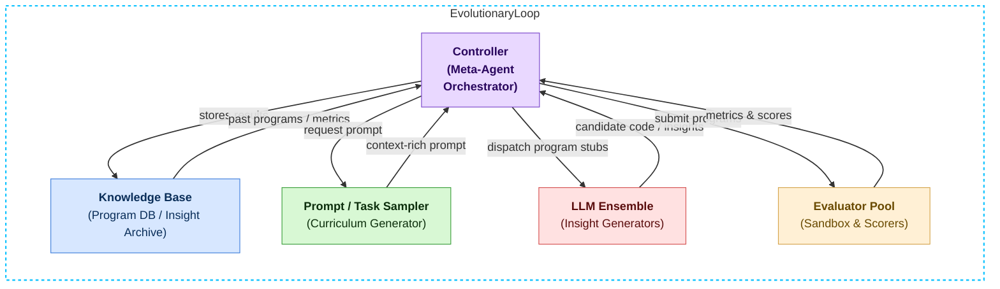

[See docs/DISCLAIMER_SNIPPET.md](../../../docs/DISCLAIMER_SNIPPET.md)

# α-AGI Insight · Discovery Workbench

**Find the opening. Earn the conviction.** Compare cross-sector hypotheses, expose their assumptions,
allocate limited review time, and export a reproducible dossier with verification jobs and Nova-Seed drafts.
Version **1.15.0** preserves the original research presentation, numeric search, launchers and flowcharts.

[Open the browser workbench](https://montrealai.github.io/AGI-Alpha-Agent-v0/alpha_agi_insight_v0/) ·
[Insight Atlas](https://montrealai.github.io/AGI-Alpha-Agent-v0/insight/) ·
[Colab notebook](colab_alpha_agi_insight_demo.ipynb) ·
[Original research and flowcharts](RESEARCH_ARCHIVE.md)

The browser and Python paths run locally without credentials, a wallet, provider, database or GPU.
Five clearly labeled synthetic cases make every assumption inspectable. You can replace them with your
own supplied source excerpts; the tool does not fetch or authenticate those sources.
Priority scores are not forecast probabilities, valuations or a claim of beyond-human prediction.

<!-- CURRENT-DEMO:START -->
## Current runnable path — 1.23.3

**Mode:** Local evidence review. **Prerequisites:** Python 3.11–3.13 and the installed package or a source checkout.
Discovery uses only the standard library.

```bash
python -m alpha_factory_v1.demos check alpha_agi_insight_v0
python -m alpha_factory_v1.demos run alpha_agi_insight_v0 --output-dir discovery-runs
```

**Expected:** A review portfolio and six files in a content-addressed output directory.
**Scope:** Synthetic assumptions; jobs are unsubmitted; seed drafts are plaintext and unminted.
<!-- CURRENT-DEMO:END -->

## Start in two minutes

Use Python **3.11–3.13** from a source checkout. The discovery engine uses the standard library only.

```bash
python -m alpha_factory_v1.demos.alpha_agi_insight_v0 --list
python -m alpha_factory_v1.demos.alpha_agi_insight_v0 --case public-software --output insight-runs
```

The default case allocates a 60-minute review budget across eight opportunities. It saves six files
under `insight-runs/<dossier-sha256>/` and prints the exact verification command. A completed calculation
exits **0**, including a valid empty portfolio; malformed inputs or altered evidence exit **2**.
After installing the package, `insight-workbench` is the equivalent console command.

```bash
insight-workbench --input my-scenario.json --output insight-runs --json
insight-workbench --verify insight-runs/<dossier-sha256>/dossier.json
```

`--json` writes only the dossier to stdout. Errors use stderr. Output directories are content-addressed:
an identical run reuses identical files; partial, altered or symlinked run output is rejected. Use a new
output directory after investigating an interrupted or modified run.

## The browser workflow

1. **Choose a case.** The starter set compares software, energy, materials research, logistics,
   synthetic clinical data checks, education, autonomy and transport. Every source is labeled synthetic.
2. **Set review constraints.** Change available minutes, conservative score threshold, required source
   coverage and proposed job bounty. Weights are integer basis points totaling 10,000.
3. **Inspect a thesis.** Select its title to see the goal, measurable success metric, low/base/high
   assumptions and exact supplied excerpts. Missing evidence and capacity deferral have distinct states.
4. **Edit your own scenario.** Open the complete JSON editor to change opportunities, sources and
   intervals. Apply or discard pending changes before exporting. No arbitrary code is evaluated.
5. **Export the review bundle.** The six files below have identical bytes in Python and the browser.
6. **Return with evidence.** Import a dossier to recompute every score, portfolio choice, job and draft.
   A modified result fails verification even if someone recomputes its checksum.

Save/Restore is explicit, uses this browser's local storage and never clears another workspace's data.
Export a ZIP for a portable copy. After a successful first load and service-worker installation,
the workbench supports offline reload and recalculation. Private browsing or blocked storage may prevent
saved drafts or offline caching; the local Python path remains available.

| Case | Question | Expected behavior |
|---|---|---|
| `public-software` | Where should the next hour of review go? | Select a review portfolio within 60 minutes |
| `capacity-shock` | What if only 20 minutes remain? | Defer eligible opportunities that cannot fit |
| `evidence-gap` | What if demand excerpts are missing? | Source-coverage gate prevents selection |
| `optimism-trap` | Can a wide optimistic range justify priority? | Conservative scores govern the 35-minute portfolio |
| `zero-capacity` | What if there is no review capacity? | Valid empty portfolio; no seed drafts |

## What the engine computes

For each opportunity and each interval endpoint, it computes the exact integer numerator
`sum(weight[dimension] * signal[dimension][endpoint])`. Divide by **1,000,000** to display a score out
of 100. The four dimensions are demand, feasibility, readiness and advantage. Supplied source coverage
is the sum of weights whose signals reference an existing excerpt. It measures reference coverage,
not source quality, truth, freshness or independence.

Eligibility requires the low score and source coverage to meet the supplied thresholds. Exact 0/1
knapsack then maximizes the **sum of conservative priority numerators** within the supplied review
minutes. Each opportunity can be selected once. Ties prefer fewer minutes, then lexicographically
ordered opportunity IDs. The objective neither models profit nor accounts for cross-opportunity
correlation or overlapping review effort. Zero-score items need not consume review time.

The landscape ranks by conservative score, base score, then ID. Rank separation means the highest low
score exceeds every rival high score. The supplied ranges are **not statistical confidence intervals**.
Selection returns `REVIEW_REQUIRED`; eligible unselected rows return `CAPACITY_DEFERRED`; unmet input
gates return `EVIDENCE_REQUIRED`. There is no automatic approved state.

## Evidence and Ascension handoff

| File | Purpose |
|---|---|
| `scenario.json` | Complete normalized inputs and supplied excerpts |
| `dossier.json` | Inputs, exact decisions, jobs, drafts and SHA-256 |
| `jobs.json` | One unsubmitted verification job for every opportunity, bound to the input hash |
| `nova-seeds.json` | Selected opportunities as plaintext, unminted, unfunded seed drafts |
| `review-brief.md` | Portable human review summary |
| `SHA256SUMS` | SHA-256 of the other five exact files |

Every job carries a **goal ↔ success metric ↔ bounty**, a seven-day duration and price weight 5,000.
Bounties use $AGIALPHA's 18-decimal base units as decimal strings. All opportunity jobs are exported,
including those deferred or missing evidence, so a reviewer can commission the verification they need.
The bundle's total proposed bounty covers **all** jobs, not only the selected portfolio. No funds move.

With the installed chain extra or hash-locked operator environment:

```bash
alpha-agent ascension-compile insight-runs/<dossier-sha256>/jobs.json --output fusion-plan.json
```

The [Ascension protocol guide](../../../docs/agent/ASCENSION_PROTOCOL.md) documents the separately
operated cryptosealing, ERC-721 Nova-Seed lifecycle, validator risk oracle, MARK funding, Sovereign
activation, staked ENS agents, validator approval and marketplace settlement with the 1% payout burn.
This workbench prepares inputs for that lifecycle. It does not encrypt or mint an NFT, authenticate a
validator, certify compliance, trade, escrow funds, submit jobs or authorize enterprise execution.
Those gates require their own evidence, authenticated roles and deployment review.

## Input contract and limits

Use an exported `scenario.json` as the complete schema example. Unknown or missing fields fail closed.
The schema is `agialpha.insight.scenario.v1`; dossiers use `agialpha.insight.dossier.v1`.

| Input | Accepted range |
|---|---|
| JSON | UTF-8; at most 1,000,000 bytes and 24 nested levels; no duplicate keys, nonfinite numbers or lone surrogates |
| Opportunities / sources | 1–24 / 1–32, with unique lowercase ASCII IDs of 1–40 characters |
| Signal low/base/high | Integer 0–10,000, ordered low ≤ base ≤ high |
| Weights | Four integers 0–10,000 totaling 10,000 |
| Review minutes | Capacity 0–2,400; each opportunity 1–2,400 |
| Minimum score / coverage | Integer basis points 0–10,000 |
| Job bounty | 1–1,000,000 AGIALPHA per job |
| Source URLs | HTTPS hostname, no credentials, backslashes or explicit port; never fetched |
| Text | UTF-8 byte limits: title 160, note 600, sector 80, thesis 500, goal 240, success metric 400, excerpt 1,200, URL 500 |

A signal's source is a supplied source ID or an empty string for missing coverage. Inputs may contain
Unicode; control characters are rejected in text fields. Decimal strings and booleans are not numbers.
Integral JSON numbers such as `20.0` normalize to integers for portable exports.

## Preserved numeric search and launchers

The original numeric-target example remains available explicitly:

```bash
python -m alpha_factory_v1.demos.alpha_agi_insight_v0 --legacy --offline --episodes 30 --seed 42 --json
python -m alpha_factory_v1.demos.alpha_agi_insight_v0.insight_demo --episodes 30 --target 3 --seed 42
bash alpha_factory_v1/demos/alpha_agi_insight_v0/run_insight_demo.sh --offline --episodes 3
```

It now expands a bounded binary UCB search tree, backpropagates each observation once and ranks sectors
by their own observed rewards. Sector names map from numeric policies modulo the list length; the
numbers are **not evidence about those industries**. A local RNG preserves the caller's global state.
Default seed is 0; episodes are 1–500; exploration is finite 0–10; target is ±10,000.
Optional logs use a per-run directory with `scores.csv`, `summary.json` and an optional ranking plot.

All original `official_demo*`, `run_demo`, `beyond_human_foresight` and bridge modules remain.
An API key's presence does not automatically select a provider. Provider rewriting requires explicit
`--rewriter openai|anthropic` and a model through `--model` or explicit YAML configuration, is limited to 20 calls with 15-second timeouts and no retries,
and validates the one-step JSON-integer response. If that step is already expanded, the remaining
unexpanded step is used. Provider errors are surfaced. `--offline`, `ALPHA_AGI_OFFLINE`,
`ALPHA_TEST_OFFLINE` or `NO_LLM` forbid provider calls. Optional legacy runtime/ADK exposure requires
`--runtime` and a compatible installed interface; current SDK presence alone does not establish that.
Dependency verification is opt-in with `--verify-env`; launching never installs packages automatically.

The CLI alone can read a local sector file or `ALPHA_AGI_SECTORS`; the API never resolves filesystem
paths or ambient sector settings. YAML config accepts only documented settings and requires PyYAML.

## Local dashboard and API

Install the project dependencies for FastAPI/Uvicorn or Streamlit, then:

```bash
python -m alpha_factory_v1.demos.alpha_agi_insight_v0 --dashboard
python -m alpha_factory_v1.demos.alpha_agi_insight_v0.api_server --port 8000
```

The dashboard opens a discovery view with downloadable evidence; the original search has explicit
provider controls. The API binds `127.0.0.1` by default:

| Route | Behavior |
|---|---|
| `GET /healthz` | Local offline service status |
| `GET /sectors` | Default numeric-search labels |
| `POST /discovery` | Bounded scenario JSON → recomputed dossier (1 MB limit) |
| `POST /insight` | Strict local numeric search (16 KB limit); no providers, model or output paths |

Requests require `application/json`. If `API_TOKEN` is set, send `Authorization: Bearer <token>`.
Origin-bearing browser requests are rejected. One calculation runs at a time; busy calls receive **429**
with `Retry-After: 1`. Other errors: **401** authentication, **403** browser origin, **413** body size,
**415** content type and **422** invalid input. Non-loopback binding requires `--allow-network` and a
24-character token; use a separately managed TLS/authenticated reverse proxy for remote operation.
The built-in API is a bounded local service, not a multi-tenant deployment platform.

## Notebook, validation and original material

The maintained notebook pins source to release `v1.15.0`, runs all five cases without provider calls,
recomputes dossiers and writes a portable bundle. Set `ALPHA_INSIGHT_SOURCE` to a local checkout to
run fully offline. It checks Python compatibility and fails visibly instead of swallowing install errors.
The [original notebook](research_notebook_archive.ipynb) and [complete original README](RESEARCH_ARCHIVE.md)
remain byte-for-byte archives; their older setup commands and aspirational claims are historical.

Release acceptance checks independent exhaustive portfolio optimality, Python/browser parity,
input-bound job compilation, altered and rehashed evidence, API boundaries, all browser cases, exact
ZIP bytes, small screens, keyboard access, WCAG A/AA checks and offline reload. The public report must
match the packaged commit, version, asset hashes and native case results before release finalization.

```bash
python -m pytest --noconftest -o addopts= tests/test_insight_discovery.py tests/test_insight_v0_boundaries.py
python -m scripts.validate_discovery_core
python -m scripts.validate_discovery --site site --axe-script tests/browser/node_modules/axe-core/axe.min.js
```

## Original architecture flowchart — preserved

The original diagram below describes the research architecture and future direction; it does not
assert that the local numeric search or review workbench implements a production autonomous AGI.


