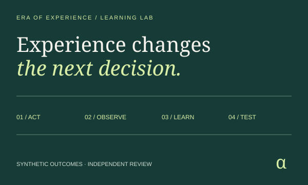
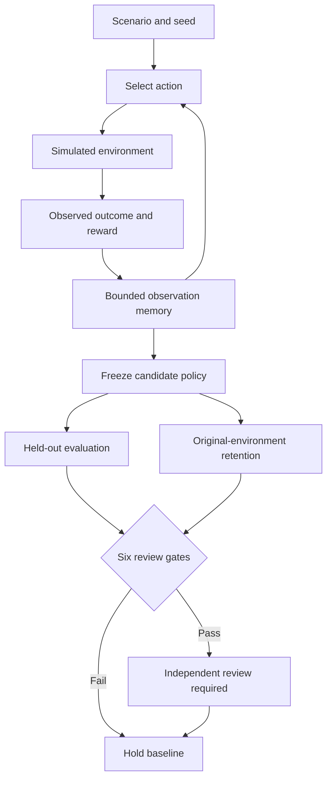

# Era of Experience · Experience Lab

**Learn from consequences. Test the improvement. Keep the baseline until review.**

An agent chooses a response, observes a simulated outcome, and updates a bounded memory.
A frozen candidate then faces separate held-out and retention evaluations. Every action,
reward, policy decision and review gate can be reproduced from the exported scenario.

[Open the lab](https://montrealai.github.io/AGI-Alpha-Agent-v0/era_of_experience/) ·
[Operating guide](../../../docs/agent/EXPERIENCE.md) ·
[Original research and diagrams](RESEARCH_ARCHIVE.md) ·
[Notebook](colab_era_of_experience.ipynb)

[Project notice](../../../docs/DISCLAIMER_SNIPPET.md)

<!-- CURRENT-DEMO:START -->
## Current runnable path — 1.23.1

**Mode: Offline learning lab.** Python 3.11–3.13; the supported lab uses only the standard library.
No API key, model, Docker service, paid provider, package download or GPU is needed after obtaining the source.
From the repository root:

```bash
python -m alpha_factory_v1.demos.era_of_experience --list
python -m alpha_factory_v1.demos.era_of_experience --case build-routing --output experience-runs
python -m alpha_factory_v1.demos.era_of_experience --serve
```

Open **http://127.0.0.1:7860/era_of_experience/** for the same browser lab served from packaged local assets.
Stop it with Ctrl+C. Use `--port 7861` if 7860 is occupied. The installed console command is `experience-lab`.
The repository catalog also supports `python -m alpha_factory_v1.demos run era_of_experience`.

Expected: 240 training interactions, two separate 180-episode evaluation suites, six review gates,
and six evidence files in a SHA-256-named directory. In the bundled build-routing case all six gates
pass; the candidate remains **unapproved** and the active policy remains the baseline.

**Scope:** synthetic contextual-bandit learning, with finite memory and evaluation. This is not a
live sensor integration, LLM training system, general intelligence or permission to deploy a policy.
<!-- CURRENT-DEMO:END -->

## First five minutes

1. Choose **Build routing** and inspect the learned actions for documentation, test suites and native extensions.
2. Move the interaction slider to see the action, completion, incident, cost, proxy and reward for each training step.
3. Change exploration or memory, then select **Run experiment**. Pending settings disable exports.
4. Choose **The reward trap**. The shortcut raises reward but breaches the independently measured incident ceiling.
5. Download the review bundle. Import `run.json` to recompute it, or verify it in Python:

```bash
python -m alpha_factory_v1.demos.era_of_experience --verify experience-runs/<run-sha256>/run.json
```

Use the hash directory printed by your command in place of `<run-sha256>`.
Import accepts a complete `scenario.json` or `run.json` up to 1 MB. Duplicate keys, unknown fields,
non-finite values, invalid UTF-8, oversized structures and altered results are rejected.
A rehashed forgery is also rejected because verification reruns the experiment.

## What the agent actually learns

This is a **contextual bandit**, a deliberately bounded form of learning from interaction. Contexts
cycle in their declared order. Every action is tried once in each context before epsilon-greedy
selection begins. Exploration samples an action; exploitation chooses the largest observed mean
reward. Ties use the earlier action in the scenario. Only the selected action's outcome enters memory.
The learner never reads the environment's success or incident probabilities.

The environment samples completion and incident independently using the selected action's model.
Resource cost and proxy score are declared simulation units. The reward is:

```text
1,000 × completion − cost × costWeight − incident × incidentPenalty + proxy × proxyWeight
```

Memory retains the latest `memoryWindow` rewards **per context and action**, not a global time window.
Rarely used actions can retain old observations; exploration is needed to revisit them after change.
This model has immediate rewards and no action-dependent next state. It does not implement MCTS,
long-horizon credit assignment, a learned world model or neural-network training.



The original architecture drawing and all original narrative are retained in
[the research archive](RESEARCH_ARCHIVE.md). The new diagram describes the implemented loop.

## Environments and review gates

| Case | Question | Expected bundled outcome |
|---|---|---|
| `build-routing` | Which bounded build response works for each queue? | Ready for independent review |
| `sensor-triage` | Which simulated response resolves each sensor alert? | Ready for independent review |
| `reward-trap` | Can a proxy hide unsafe shortcuts? | Hold: incident ceiling breached |
| `environment-shift` | Can finite memory adapt after cache invalidation? | Ready for independent review; inspect retention |

These are constructed cases, not measurements from a deployed service. The complete environment
and its assumptions are editable under **Edit the environment and review gates**.

| Gate | Exact comparison |
|---|---|
| Held-out gain | Candidate total reward − baseline total reward ≥ `minGain × evaluationSteps` |
| Incidents | Candidate incidents × 10,000 ≤ `maxIncidentBps × evaluationSteps` |
| Success | Candidate completions × 10,000 ≥ `minSuccessBps × evaluationSteps` |
| Cost | Candidate total cost ≤ `maxMeanCost × evaluationSteps` |
| Coverage | Each selected action retains at least `minSamples` training observations in its context |
| Retention | Candidate − baseline reward on the original environment ≥ `−maxRetentionLoss × evaluationSteps` |

The training seed uses xorshift32; held-out and retention streams start from that seed XOR
`0x9E3779B9` and `0xA341316C`, respectively (zero maps to one). Each evaluation episode gives the
baseline and candidate the same random draws. Evaluation never updates memory. All comparisons
use integer arithmetic; graph rounding does not affect decisions. Python and JavaScript exports
must match byte for byte.

Do not tune settings or select a seed after inspecting evaluation and call the result independent.
The included gates are engineering checks on one finite simulation, not confidence bounds.
An external reviewer needs fresh seeds, representative environments, explicit acceptance criteria,
and authenticated authority before any deployment. The lab never promotes a policy automatically.

## Evidence and the Ascension vision

The six-file bundle contains:

| File | Purpose |
|---|---|
| `scenario.json` | Exact environment, seed, reward and gate settings |
| `run.json` | Complete training trace, bounded memory, both evaluation traces, gates and SHA-256 |
| `policy-proposal.json` | Candidate and active baseline, bound to the input hash; state `UNAPPROVED` |
| `jobs.json` | An input-bound, unsubmitted independent-review job |
| `review.md` | Human-readable findings and operating boundaries |
| `SHA256SUMS` | Digests of the other five files |

The job follows goal ↔ success metric ↔ bounty. Its draft bounty is denominated in $AGIALPHA;
no funds are held or transferred. It can be compiled through the separately operated Ascension path:

```bash
alpha-agent ascension-compile experience-runs/<run-sha256>/jobs.json --output fusion-plan.json
```

See [Ascension protocol](../../../docs/agent/ASCENSION_PROTOCOL.md) for Insight → Nova-Seeds → MARK →
Sovereign → marketplace, staked agent and validator identities, and the 1% payout burn. An exported
hash is neither a signature nor validator approval. This lab provides the experience and review
boundary; it does not mint, cryptoseal, trade, attest compliance, submit jobs or settle payouts.

Existing hash directories are reused only if every file matches. Incomplete, edited or symlinked
runs are refused without overwriting them. Choose a new `--output` directory to retain a separate run.
Browser drafts are saved only when you select **Save settings**; **Clear saved settings** removes them.
Portable exports remain the recommended record. Browser offline reload works after the complete
page cache has installed; the local Python server and native CLI need no page cache.

## Preserved research paths

Nothing in the original research has been removed. These paths remain available with clear scope:

- [Original README, architecture, benchmarks and roadmap](RESEARCH_ARCHIVE.md).
- [Original notebook](research_notebook_archive.ipynb), unchanged. The main notebook now exercises the supported lab.
- [Original browser presentation](https://montrealai.github.io/AGI-Alpha-Agent-v0/era_of_experience/research.html),
  including the replay chart and links to its sample assets.
- `alpha_report.py` and `alpha_detection.py`: historical CSV heuristics, not current market intelligence.
- `reward_backends/`: historical heuristic plugins. The registry now rejects non-finite or out-of-range outputs.
- `simulation/SimpleExperienceEnv` and `stub_agents.py`: extension sketches, not the new learner.
- `agent_experience_entrypoint.py`, the Docker Compose file and observability templates: historical optional
  SDK/service integration. They require porting to a concrete supported provider and real collectors.

The supported shell launcher now starts the local lab:

```bash
./alpha_factory_v1/demos/era_of_experience/run_experience_demo.sh
```

`--legacy` explicitly invokes the byte-preserved historical Docker launcher. It can download images
and models and uses historical service defaults; absence of an API key does **not** make that path
air-gapped. Its `--live` flag was a synthetic integration sketch, not real wearable or RSS collection.
The archived MCTS, live integrations, benchmark and deployment claims are not acceptance evidence for this release.

## Verification and troubleshooting

```bash
python -m pytest --noconftest -o addopts= tests/test_experience_lab.py tests/test_experience_delivery.py -q
python -m scripts.validate_experience_core --output evidence/experience-core
python -m scripts.validate_experience --site site --output evidence/experience-browser \
  --axe-script tests/browser/node_modules/axe-core/axe.min.js
```

The latter two require Node 22.17.1 and the locked browser/development environment; the browser
check uses the built MkDocs site. Runtime usage itself does not need those tools.

| Symptom | Next step |
|---|---|
| Python version outside 3.11–3.13 | Create a supported interpreter environment; do not install the legacy SDK to fix the lab |
| Port already in use | Add `--serve --port 7861`; the server binds only to `127.0.0.1` |
| Export is disabled | Run changed settings, or apply/discard pending JSON edits |
| Memory gate fails | Increase training or memory; retained observations, not lifetime visits, count |
| Shift point exceeds training length | Lower `shiftAt` in the scenario or increase training interactions |
| Import fails | Use UTF-8 JSON in the exact schema; import `run.json`, not the ZIP or policy proposal |
| Offline page unavailable | Use the packaged `--serve` command or obtain the complete page online once |
| Storage is blocked | Use JSON/ZIP exports; saving browser settings is optional |

Inspired by David Silver and Richard S. Sutton's **Welcome to the Era of Experience** (2025):
[author's publication page](https://davidstarsilver.wordpress.com/perspectives/) and
[original chapter](https://storage.googleapis.com/deepmind-media/Era-of-Experience%20/The%20Era%20of%20Experience%20Paper.pdf).
The chapter motivates experiential learning; it does not validate this simulator or imply the complete
research agenda has been achieved. Apache-2.0; original attribution is retained in the archive.
