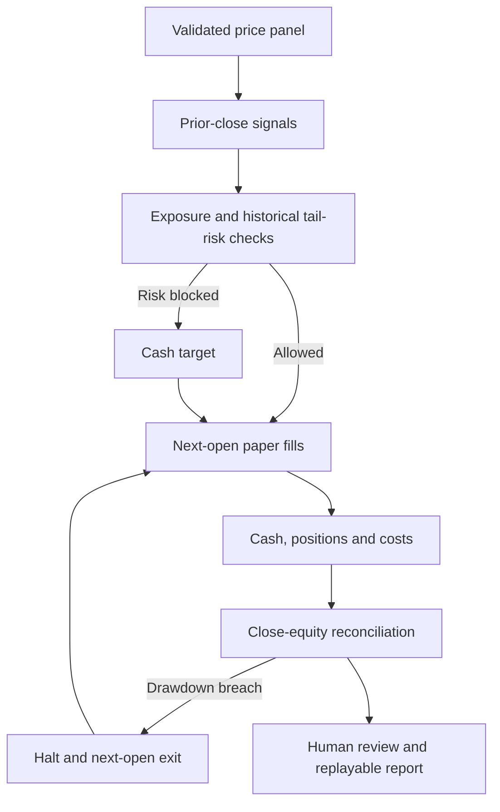

[See docs/DISCLAIMER_SNIPPET.md](../../../docs/DISCLAIMER_SNIPPET.md)

# Finance Alpha · Evidence before exposure

**A paper-research terminal with an inspectable cash ledger, realistic timing, explicit costs and exact replay.**

Compare momentum, reversion, equal-weight rebalancing and cash across synthetic trend,
reversal and gap scenarios—or import your own aligned price bars. Every decision, simulated
fill, risk block and equity mark is available for review. No API key, model, Docker or broker account is needed.

<!-- CURRENT-DEMO:START -->
## Start locally — 1.24.1

From the repository root with **Python 3.11–3.13**, run:

```bash
python -m alpha_factory_v1.demos.finance_alpha
```

Open **http://127.0.0.1:7864**, select **Run paper experiment**, then try **Gap and recovery**.
The latter intentionally demonstrates a loss and a drawdown halt. All bundled data is labeled synthetic.
Use **Download full JSON** for the complete evidence. Stop the server with **Ctrl+C**.

The supported lab uses only the Python standard library. The same Python command works
from a source checkout on Linux, macOS or Windows; the release matrix verifies Python
3.11–3.13 on Linux. Native macOS/Windows operation remains unverified.
An optional Bash shortcut is `bash alpha_factory_v1/demos/finance_alpha/run.sh`.
Change an occupied port with `--port 7865`. Always use the printed `127.0.0.1` URL.

**Mode:** Local paper research. No exchange connection, wallet, live orders, or external inference.
The published browser page displays recorded engine results; calculations with new inputs run in the local app.
<!-- CURRENT-DEMO:END -->

## A complete, finite experiment

```bash
python -m alpha_factory_v1.demos.finance_alpha --headless --case crash --output finance-run
python -m alpha_factory_v1.demos.finance_alpha --verify finance-run/report.json
```

Open `finance-run/report.html` in any modern browser. The report is self-contained and works offline.
The new directory contains six files: `report.html`, `report.json`, `prices.csv`, `trades.csv`,
`equity.csv` and `manifest.json`. Existing output directories are refused. If a write is interrupted,
`INCOMPLETE` remains visible; choose a new destination when retrying.
The manifest hashes exported bytes; replay recomputes the full result with the same engine revision.
Neither proves data authenticity or future performance.

CLI settings require `--headless`; interactive settings belong in the dashboard.
Use `--help` to inspect every option without starting a service or installing anything.

## Import your own data

Use the dashboard’s **Risk limits & CSV import**, or:

```bash
python -m alpha_factory_v1.demos.finance_alpha --headless --input prices.csv \
  --strategy momentum --fee-bps 10 --slippage-bps 5 --output imported-run
```

The header must be exactly `date,symbol,open,close`, in that order:

```csv
date,symbol,open,close
2025-01-02,EXAMPLE,100,101
2025-01-03,EXAMPLE,102,100
```

This snippet only illustrates the format. Supply **at least lookback + 2 complete dates**
(default 22), at most 2,000 dates, eight symbols and 2 MB. Every date must contain exactly
the same symbols; dates must be chronological and unique per symbol. Prices must be finite,
positive and denominated in the same USD unit. No missing bars are filled or silently dropped.
Symbol names use uppercase letters, digits, underscores, dots or hyphens and start with a letter.

Imported data is explicitly **user supplied and unverified**. Review provenance, permissions,
survivorship, splits and dividends before interpreting a result. The engine does not fetch or
adjust prices. It charges costs on fractional full fills; this omits market depth, partial fills,
market impact, taxes, financing and corporate actions. Returns are per supplied bar, not assumed daily.

## Decisions you can follow



| Convention | Implementation |
|---|---|
| Signal timing | Momentum is prior close / close one lookback earlier − 1. Momentum selects up to two positive names; reversion selects up to two negative names. Ties use symbol order. |
| Execution | Only the following supplied open is used for fills. Buys pay adverse slippage; sells receive less. Both incur fees. |
| Capital | Cash funds purchases. No borrowing or short positions. Targets respect total exposure and per-asset caps; drift between rebalances can exceed a target. |
| Tail-risk gate | Historical proposed-portfolio returns align assets on the same dates. Estimated CVaR95 above the limit sets a cash target for the rebalance. |
| VaR / CVaR | Losses are negative returns. VaR95 is the nearest-rank 95th percentile; CVaR95 averages the worst ceil(5% × sample size) losses. Both are floored at zero. Small samples are especially unstable. |
| Drawdown stop | A close-equity breach schedules liquidation at the next supplied open and blocks re-entry. Gap loss can exceed the threshold. A final-bar breach remains pending. |
| P&L | Cash + marked positions − initial capital. Average-cost realized plus unrealized P&L must reconcile. Slippage is already in fill prices, so it is not subtracted again. |
| Benchmark | Same initial capital, evaluation dates, exposure/position caps and costs; equal-weight buy once, then hold without strategy risk exits. Cash earns zero nominal interest. |
| End of run | Positions remain marked at the last close; there is no fictitious terminal liquidation. |

No parameters are fitted and no model is called. Trying many configurations on the same data is
not an independent out-of-sample test. Positive returns on synthetic prices are not evidence
of investable alpha. A risk estimate or stop rule cannot guarantee a loss ceiling.

## Notebook and Python use

The [notebook](finance_alpha.ipynb) now runs the same engine directly. It does not install Docker,
run privileged commands, download models or require a background service. Open it in a Python
environment where the repository is on the import path or the matching wheel is installed.

```python
from alpha_factory_v1.demos.finance_alpha.paper import Config, run
from alpha_factory_v1.demos.finance_alpha.delivery import verify

report = run(config=Config(fee_bps=15, slippage_bps=10), case="crash")
print(report["result"]["summary"])
print(verify(report))
```

The report includes canonical input prices and their SHA-256, configuration, strategy and benchmark
ledgers, estimated risks, every decision, source-code hash and explicit limitations.

## Troubleshooting

| Symptom | Action |
|---|---|
| Python module not found | Run from the repository root or install the matching release wheel. |
| Port already occupied | Stop the other process or use `--port 7865`. |
| Local page returns 403 | Use the exact printed `http://127.0.0.1:PORT` address and reload the page. |
| CSV rejected | Check header order, full aligned dates, positive prices and size limits. No partial result is retained. |
| No fills | Inspect cash strategy, signal signs, lookback warm-up, exposure limits and tail-risk decisions. |
| Drawdown exceeds its threshold | Stops execute at the next open; gaps are not capped. Inspect the fill trail. |
| Report verification fails | Use the same release and unmodified input/configuration. Verification rejects altered metrics or engine fingerprints. |
| Output exists / incomplete export | Choose a new directory. Existing evidence is never overwritten. |

## Preserved legacy integration and original vision

The [original guide](archive/README.original.md), [original notebook](archive/finance_alpha.ipynb.txt),
[original launcher](archive/deploy_alpha_factory_demo.sh.txt), [original helper](archive/agent_control.py.txt)
and [original finance agent](archive/finance_agent.py.txt) are retained byte-for-byte with a
[checksum manifest](archive/manifest.json). Original imagery and gallery research assets remain available.

`deploy_alpha_factory_demo.sh` remains a **legacy Docker integration example**. It requires a
separately available container image and compatible `/api/finance/*` routes; those routes and image
signing claims in the original guide are not certified by this release. The current repository's
supported lab does not depend on that image or the historical `openai.agents.AgentRuntime` interface.
Do not treat historical claims of sub-two-minute setup, automatic model fallback, image signatures,
mesh registration or institutional-grade trading as acceptance evidence.

The legacy `FinanceAgent` retains its tools and telemetry. Its paper cash ledger and marked P&L
are corrected, risk returns are aligned across assets, missing quotes abort the cycle, and a risk
breach or uncertain order outcome halts further orders for review. Its halt does **not** automatically
flatten positions. Broker credentials alone do not activate testnet: `FIN_BROKER_MODE=testnet`
requires explicit configuration and a separately validated testnet account. Receipt reconciliation,
restart persistence, symbol filters and external service integration remain outside the supported lab.
The local research terminal ignores `.env` and all broker credentials.

The full α-AGI vision remains an architectural goal. This release supplies a reviewable research
and measurement component; it does not establish autonomous financial production readiness,
profitable trading, authenticated validators, on-chain settlement or achieved AGI.
