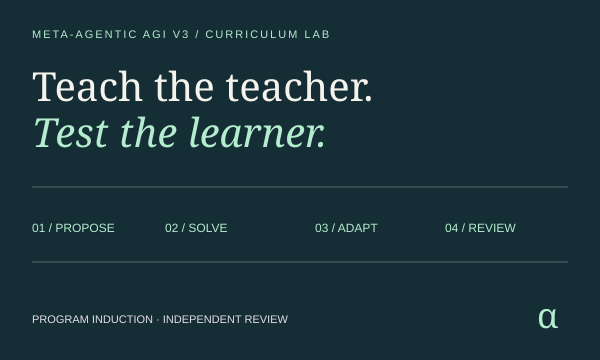
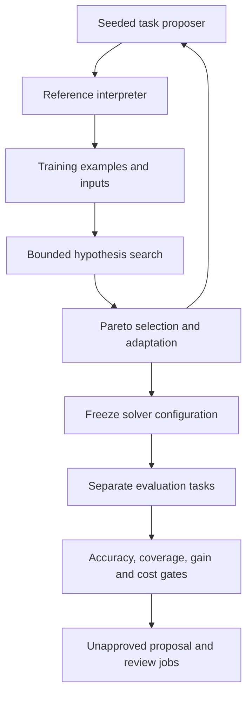
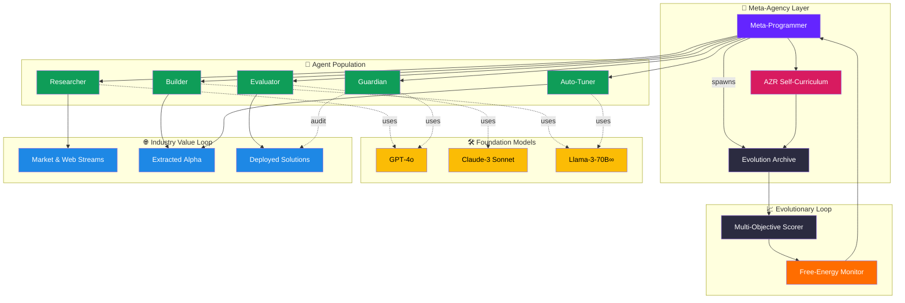

[See docs/DISCLAIMER_SNIPPET.md](../../../docs/DISCLAIMER_SNIPPET.md)

# Meta-Agentic AGI v3 — Curriculum Lab

**Teach the teacher. Test the learner.** Generate reasoning tasks, evolve the configuration of an independent
program solver, then evaluate the frozen winner on separate tasks. Inspect every example, attempted search,
selection decision, parent/child relationship and review gate.

[Open the browser lab](https://montrealai.github.io/AGI-Alpha-Agent-v0/meta_agentic_agi_v3/) ·
[Operator guide](../../../docs/agent/CURRICULUM_LAB.md) ·
[Original flowcharts and research](RESEARCH_ARCHIVE.md) ·
[Original visual replay](https://montrealai.github.io/AGI-Alpha-Agent-v0/meta_agentic_agi_v3/research.html)

<!-- CURRENT-DEMO:START -->

## Start in two minutes — 1.23.0

The browser lab requires no account, key or installation. Choose a question, run the curriculum, inspect a round,
and download the evidence. Everything is computed locally. Once cached, the public lab can recalculate offline.

For Python 3.11–3.13, follow the repository [installation guide](../README.md#start-locally), then:

```bash
python -m alpha_factory_v1.demos check meta_agentic_agi_v3
python -m alpha_factory_v1.demos.meta_agentic_agi_v3 --list
python -m alpha_factory_v1.demos.meta_agentic_agi_v3 --case balanced --output curriculum-runs
python -m alpha_factory_v1.demos.meta_agentic_agi_v3 --serve
```

The local browser opens at `http://127.0.0.1:7863/meta_agentic_agi_v3/`; copy the printed address into your browser.
Stop with **Ctrl+C**. The equivalent installed command is `curriculum-lab`.
The native core uses only the standard library and never auto-selects cloud credentials.

<!-- CURRENT-DEMO:END -->

## Four questions, four useful experiments

| Case | Question | Default result |
|---|---|---|
| `balanced` | Can a meta-agent improve a small solver across three task families? | Eligible for independent review |
| `coverage-trap` | What if the curriculum only teaches arithmetic? | Held for missing skills |
| `resource-limit` | What if a correct solver exceeds its operation allowance? | Held for resource cost |
| `deep-composition` | Can configurations compose three operators? | Eligible for independent review |

Eligibility is not approval. The active solver remains the baseline in every case. Thresholds and seeds must be
chosen before inspecting review results; repeatedly tuning against the review set invalidates an independent test.

## What actually runs



- **Proposer:** generates finite compositions of `inc`, `dec`, `double`, `negate`, `abs`, `square` and `mod3`.
  It rejects duplicate behaviors within a round and adjusts difficulty and family weights from recent training results.
  Proposal attempts are capped at 512, so a saturated grammar may produce fewer tasks than requested.
- **Solver:** enumerates a deterministic grammar using examples only. It never receives the reference program,
  expected test outputs or task family. The first matching hypothesis predicts separate test inputs.
- **Meta-agent:** mutates grammar depth, operator palette and hypothesis budget. Pareto selection considers actual
  correctness and counted interpreter operations; a stated entropy-weighted utility selects among the frontier.
- **Replay:** retains at most 48 training tasks. Each round compares candidates on the same replay buffer.
- **Review:** creates a separate random stream only after the final configuration is frozen. Up to eight distinct
  tasks per family test generalization; each task's actual count and outcome are retained. No review result feeds selection.
- **Free-energy proxy:** mean operations minus temperature × solved-family Shannon entropy, using shared rounded
  millinat logarithms. This is a cost/diversity diagnostic, not physical energy, a variational ELBO or a calibrated risk measure.

This implements a bounded form of second-order agency. It does **not** train AZR model weights, implement PPO,
prove general intelligence, demonstrate financial alpha, or deploy an autonomous enterprise.
The [Absolute Zero paper](https://arxiv.org/abs/2505.03335) describes model training beyond this lab's tested scope.

## Reproduce and retain evidence

Each run has a SHA-256 named directory containing `scenario.json`, `run.json`, `solver-proposal.json`, `jobs.json`,
`review.md` and `SHA256SUMS`. Identical reruns reuse an identical bundle. Altered or incomplete existing bundles are
rejected; use a new output directory after investigating the difference. Copy the whole run directory for backup.

```bash
python -m alpha_factory_v1.demos.meta_agentic_agi_v3 --input my-scenario.json --output curriculum-runs
python -m alpha_factory_v1.demos.meta_agentic_agi_v3 --verify curriculum-runs/RUN_HASH/run.json
```

Replace `RUN_HASH` with the printed directory name. Verification recomputes the entire experiment, rejecting even
edited results with a freshly recomputed checksum. Input files must be bounded UTF-8 JSON (1 MB maximum), without
duplicate keys, non-finite numbers, unknown fields or invalid Unicode. Browser and Python produce identical canonical evidence.
Checksums prove content consistency, not authorship or validator approval.

The exported review job uses the Ascension `goal` ↔ `successMetric` ↔ `bounty` specification. Its draft bounty is
100 $AGIALPHA in 18-decimal base units. It can be compiled into a FusionPlan through the existing
[Ascension runtime](../../../docs/agent/ASCENSION_PROTOCOL.md); no minting, escrow, transfer, auction or approval occurs here.

## Original research, maintained compatibility

All original flowcharts, narrative and references are retained verbatim in [RESEARCH_ARCHIVE.md](RESEARCH_ARCHIVE.md).
The [original notebook](colab_meta_agentic_agi_v3_original.ipynb), [configuration](configs/research_original.yml),
visual replay and its assets remain available. Historical production, model-training, broker, sandbox and financial
claims in those materials are research aspirations, not guarantees of this implementation.

The updated [notebook](colab_meta_agentic_agi_v3.ipynb) runs the same finite core and verifies its exports.
The original provider experiment is still available:

```bash
python -m alpha_factory_v1.demos.meta_agentic_agi_v3.meta_agentic_agi_demo_v3 --provider stub --gens 2 --db lineage.sqlite
python -m alpha_factory_v1.demos.meta_agentic_agi_v3.meta_agentic_agi_demo_v3 --mode streamlit --db lineage.sqlite
```

The stub is explicitly an identity fixture. The provider experiment now asks a separate solver for an answer without
revealing the expected output; temperature adaptation is a heuristic, not PPO. Generated Python in every maintained
v3 execution path requires a usable Docker sandbox, with the repository's 120-second/2-GiB limits, no network and
read-only filesystem. `TOOLS_TRUSTED` does not enable host execution. The browser lab needs no Docker.
Cloud experiments require an explicit provider/model and their optional SDK; they may incur cost and are outside
this offline release acceptance. The historical YAML configuration is not automatically loaded by the CLI.

The [RoyaltyRadar example](businesses/royalty_radar.py) now performs reproducible mock-count reconciliation using an
explicit EUR-per-stream assumption, accounts for amounts already paid, and appends a review draft to its audit log.
It cannot send claims or payments. A native-currency transfer is not an ERC-20 payout.

```bash
python -m alpha_factory_v1.demos.meta_agentic_agi_v3.businesses.royalty_radar --demo
```

## Recovery and limits

- **Edited settings:** outputs become unavailable until you apply JSON and rerun. This prevents stale exports.
- **Saved settings:** Save/Restore/Forget are explicit and local to your browser. No result is silently restored.
- **Import rejected:** retain the original, read the error, and correct the source scenario. Do not edit the exported run.
- **Port busy:** add `--port 7864`. The local server serves only bundled assets on loopback, without upload or execution APIs.
- **No Docker:** use the finite lab or exact identity fixture. Generated programs fail closed.
- **More ambitious research:** independent datasets, task-specific validation, secure provider integration and validator
  approval are prerequisites for deployment; this finite grammar does not establish open-ended generalization.

## Preserved vision map

The original research architecture is reproduced unchanged below. The capability boundaries above govern the runnable lab.



Evaluation probes use −8, −6, 6 and 8, disjoint from training probes −5, −2, 0 and 5.
Reference functions are independently sampled from the same finite grammar and may recur across the two sets;
this tests a frozen solver configuration on fresh input probes, not transfer to an unseen language or domain.
