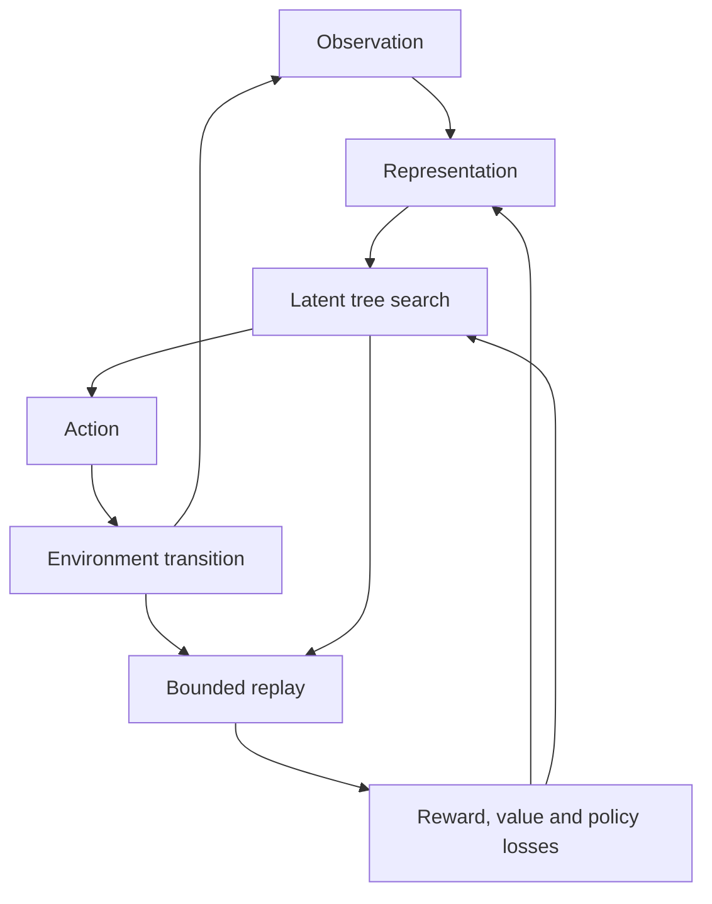

[See docs/DISCLAIMER_SNIPPET.md](../../../docs/DISCLAIMER_SNIPPET.md)

# MuZero · Planning Lab

**Learn a model. Inspect a decision. Measure the difference.**

Train a small neural network from real environment transitions, watch the learning curve,
and compare search with random actions and the network's own policy. Everything runs on your CPU.
No API key, hosted model, Ollama service or public tunnel is required.

<!-- CURRENT-DEMO:START -->
## Start here — 1.24.1

**Mode:** Bounded MuZero-style research experiment. Demo revision **2.0.0**.

From the repository root, with Python 3.11–3.13:

```bash
python -m venv .venv-muzero
source .venv-muzero/bin/activate
python -m pip install --require-hashes -r alpha_factory_v1/demos/muzero_planning/requirements.lock
python -m alpha_factory_v1.demos.muzero_planning
```

On Windows, activate with `.venv-muzero\Scripts\Activate.ps1`.
Open **http://127.0.0.1:7861**, then select **Train & compare**.
Installation requires internet or a prebuilt wheelhouse; subsequent experiments run locally.
The hash-locked CPU profile targets Linux x86-64. For other platforms, install compatible
PyTorch, Gymnasium, Gradio, pandas and NumPy wheels and validate before use.

Start with **MiniChoice**: take a reward of **0.3 now**, or learn a two-step route to **1.0**.
The dashboard shows observed rewards, three training losses, held-out evaluation and each
root action's prior, visits, predicted reward and discounted value. An expandable environment
filmstrip shows up to 12 real snapshots from a bounded evaluation episode. **Stop** cancels between
training episodes; Ctrl+C shuts down the server. Results stay in this browser session.

**Scope:** A small, genuinely trained model and a bounded search, not the paper's full Atari
system or proof of AGI. CartPole, MountainCar and Acrobot remain available research tasks;
short training can fail or regress. Zero training episodes is an explicitly untrained baseline.
The static gallery chart is a preserved **sample replay**, not a neural training run.
<!-- CURRENT-DEMO:END -->

## Run without a browser

```bash
python -m alpha_factory_v1.demos.muzero_planning --headless \
  --env MiniChoice-v0 --episodes 32 --simulations 32 --max-steps 8 --seed 42 \
  --output experiment.json --checkpoint weights.json
```

The process prints measured mean rewards and exits. Exports include the configuration,
package versions, episode-level returns, losses, before/after search statistics and portable
JSON weights with a SHA-256 checksum. Output files must be new; existing evidence is not overwritten.
The `checkpoint_sha256` field matches the exact exported `weights.json` bytes (sorted compact JSON
with one final newline). The checksum is not a signature or independent validation of the experiment.
Same-seed runs are reproducible within the tested CPU software stack; other versions or platforms
may differ. Evaluation uses separate reset seeds and performs no learning. MiniChoice is deterministic:
changing reset seeds does not create new task instances. Its repeated evaluations check behavior,
not generalization to unseen tasks.

To load saved weights programmatically:

```python
from pathlib import Path
from alpha_factory_v1.demos.muzero_planning.minimuzero import MiniMu
from alpha_factory_v1.demos.muzero_planning.training import Config, evaluate, load_checkpoint

agent = MiniMu("MiniChoice-v0", seed=42, simulations=32, render_mode=None)
try:
    load_checkpoint(agent, Path("weights.json"))
    print(evaluate(agent, Config(max_steps=8)))
finally:
    agent.env.close()
```

Checkpoint import rejects oversized files, duplicate keys, wrong environments, invalid tensor
shapes and non-finite values before changing the model. It never uses Python pickle.

## Learning and planning



| Part | Implemented behavior |
| --- | --- |
| Representation | Flat numeric observations → 32-dimensional latent state |
| Dynamics | Latent state + discrete action → predicted reward and next latent state |
| Prediction | Shared policy and scalar value heads, trained at initial and recurrent states |
| Search | PUCT with min/max Q normalization; Q includes reward + 0.997 × child value |
| Replay | Up to 64 episodes; 16 sampled positions and a three-step recurrent unroll per update |
| Exploration | Root Dirichlet noise during collection; random warm-up and explicit behavior exploration |
| Targets | Observed rewards, discounted returns and search visit policies; absorbing-state targets after termination |
| Time limits | Bootstrap the final value after truncation; zero bootstrap after true termination |
| Evaluation | Random, untrained search, trained policy and trained search on identical held-out reset seeds |
| Bounds | ≤100 training episodes, ≤500 transitions/episode, ≤128 simulations/action in the UI; total training cap |

This intentionally simplifies [Schrittwieser et al.](https://arxiv.org/abs/1911.08265)
and the [authors' pseudocode](https://gist.github.com/Mononofu/6c2d27ea1b3a9b3c1a293ebabed062ed).
It uses scalar losses, a CPU MLP and local replay rather than categorical supports, distributed actors,
prioritized replay or the paper's full training schedule. Search consults the learned model only;
it does not query the environment's transition function inside its tree.

### Original flowchart — preserved

```text
┌────────────┐  observation  ┌────────────┐
│ CartPole 🎢 ├──────────────▶│MiniMu Core │──┐
└────────────┘                └────────────┘  │ hidden
                       ▲            │          ▼
                 reward│     Recurrent model  │
                       │            ▼          │ MCTS
                ┌──────┴──────┐  policy/value  │
                │  MCTS 64×   │◀───────────────┘
                └─────────────┘
```

## Docker

```bash
./alpha_factory_v1/demos/muzero_planning/run_muzero_demo.sh
```

Requires Docker and Compose ≥2.20. The first build installs the hash-locked dependencies;
container startup does not install packages. The launcher waits for the real `/__live` endpoint.
The container runs as UID 1001 with a read-only filesystem, bounded memory/CPU, a temporary
scratch volume and dropped capabilities. The host port binds to loopback. The script prints an
exact stop command, including the Compose file path. Set `HOST_PORT=8888` to change the port.
No Ollama download or automatically registered cross-process agent is part of this maintained path.

The native server also binds to loopback. `--host 0.0.0.0` is an explicit opt-in for container
routing; this demo has no multi-user authentication and should not be exposed directly to the internet.
For offline installation, build the wheelhouse on the target platform first, then use
`pip install --no-index --find-links /path/to/wheels --require-hashes -r .../requirements.lock`.

## Colab and research archive

[Open the notebook](https://colab.research.google.com/github/MontrealAI/AGI-Alpha-Agent-v0/blob/main/alpha_factory_v1/demos/muzero_planning/colab_muzero_planning.ipynb)
for a finite training and comparison run. It does not create a public tunnel or ask for a secret.

The [original README](archive/README.original.md), [original notebook](archive/colab.original.ipynb),
[SDK experiment](archive/agent_muzero_entrypoint.original.txt) and
[Compose experiment](archive/docker-compose.original.txt) are preserved in full.
Their historical claims about guaranteed CartPole stabilization, automatic swarm coordination,
LLM narration and air-gapped first builds are aspirational or obsolete. The current implementation
and tested scope are described above. The original `MiniMu`, `mcts_policy`, `play_episode`,
`MuZeroAgent`, `run_episode` and package launch entry points remain available.

This planning component can inform the broader α-AGI research vision. It does not deploy enterprises,
mint Nova-Seeds, operate a risk oracle, settle $AGIALPHA jobs or establish real-world financial alpha.
Those need separately validated integrations; training returns are not financial returns.

## Troubleshooting

| Symptom | Action |
| --- | --- |
| Missing Torch, Gymnasium or Gradio | Activate the intended environment and install the demo lock file |
| Port occupied | Choose another `--port`, or export `HOST_PORT` for Docker |
| Training budget rejected | Reduce episodes, simulations or maximum steps; the limit is shown in the error |
| No improvement | Inspect measured returns and losses; use MiniChoice first, then tune harder tasks |
| Continuous actions rejected | Choose one of the four supported discrete-action environments |
| Plot is empty at zero episodes | Expected: there were no training transitions; evaluation still runs |
| Need old research material | Use the complete archive links above; the original flowchart remains here |

## Verification and credits

Tests cover discounted action selection, simulation accounting, depth limits, real gradients,
termination/truncation targets, deterministic initialization, checkpoint corruption and learning
on the delayed-reward task. The dedicated workflow also exercises the real dashboard and container.

DeepMind's MuZero research inspired this educational implementation; Montreal.AI and the open-source
PyTorch, Gymnasium and Gradio communities make it possible. New code is Apache-2.0 licensed.
