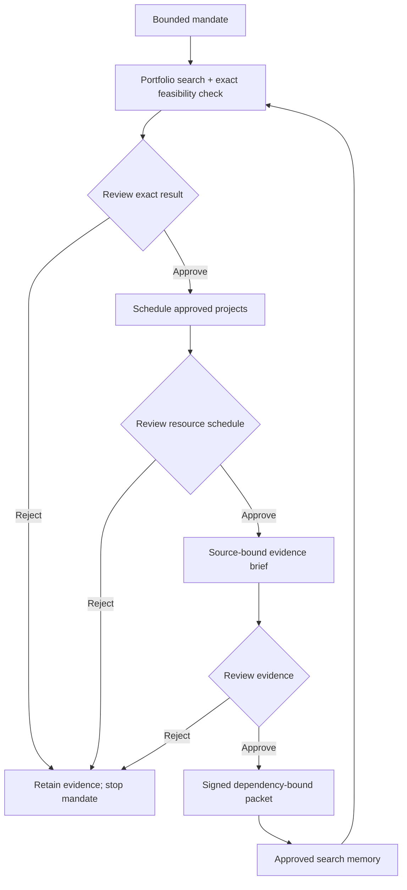

[See docs/DISCLAIMER_SNIPPET.md](../../../docs/DISCLAIMER_SNIPPET.md)

# Sovereign Workbench · Authority follows evidence

A private, review-gated operational workspace: choose a feasible portfolio, resolve shared capacity,
and prepare a source-bound evidence brief. Each stage performs actual computation, stops for your
review, and binds the next stage to the exact approved result.

[Inspect recorded runs](https://montrealai.github.io/AGI-Alpha-Agent-v0/sovereign_agentic_agialpha_agent_v0/)
· [Original presentation](https://montrealai.github.io/AGI-Alpha-Agent-v0/sovereign_agentic_agialpha_agent_v0/research.html)
· [Preserved original source](archive/manifest.json)

<!-- CURRENT-DEMO:START -->
## Current runnable path — 1.23.1

**Mode:** Signed, review-gated workflow. Actual native planning with durable local operator control.

**Prerequisites:** Python 3.11–3.13 and the installed, hash-locked agent runtime. The default path needs
no model download, wallet, API key, Docker, network service or payment.

From the repository root after [installation](../README.md#start-locally):

```bash
python -m alpha_factory_v1.demos.sovereign_agentic_agialpha_agent_v0 smoke --output sovereign-review.json
```

**Expected result:** One computed portfolio is saved in the `review` state. The balanced example selects
`contracts` and `catalog`: cost 10 staff-days, risk 4, assumed value 2,200 versus the feasible greedy
baseline of 1,850. It does not approve itself, schedule external work or spend funds. Use a new output
filename when repeating the smoke check.

**Scope:** A private, single-operator planning tool. Local Ed25519 identity and operator approvals do
not establish ENS ownership, independent validator consensus, achieved AGI or real enterprise returns.
<!-- CURRENT-DEMO:END -->

## Start locally

From a checkout of this release, create a fresh environment:

```bash
python3 -m venv .venv
source .venv/bin/activate
python -m pip install --require-hashes -r requirements-agent.lock
python -m pip install --no-deps .
python -m alpha_factory_v1.demos.sovereign_agentic_agialpha_agent_v0
```

On Windows, activate with `.venv\Scripts\Activate.ps1`; use `python` instead of `python3` if appropriate.
An installed [release](../../../docs/agent/START_HERE.md) can run the same module without a checkout.
The preserved shell entry point also launches this workspace; it no longer installs software or
replaces files without being asked.

1. Open **http://127.0.0.1:7865** and paste the access code printed in your terminal.
2. Choose **Balanced capacity**, inspect the assumptions, and select **Create mandate**.
3. Select **Run portfolio**. Inspect the feasible choices, comparison, exact output and execution trace.
4. Enter a review note, acknowledge the exact result, and approve or reject it.
5. Run and review **schedule**, then **brief**. Approval never automatically executes another stage.
6. Download the signed evidence packet and retain the public key through a separately trusted channel.

The public page contains **recorded native fixtures with automated fixture approvals**, not live
execution or independent validator decisions. All three scenarios and their signed packets are
inspectable. The local console computes fresh results with your private identity.



## What actually runs

| Stage | Input and success check | Review boundary |
|---|---|---|
| Portfolio | 2–10 projects; integer cost, value and risk; finite evolutionary search, independent budget/risk arithmetic and exhaustive optimum comparison | Benefit values are supplied assumptions, not forecasts or measured returns |
| Schedule | Only selected, approved projects; every operation, duration, precedence and resource overlap is checked; input-order baseline is reproduced | The heuristic does not promise a global scheduling optimum; no external job is submitted |
| Brief | Only approved projects' supplied sources; quotation presence and source fingerprints are verified | Citation presence does not establish source authenticity or correctness of its interpretation |

Each mission uses the maintained runtime's seven roles. Only previously approved allocation and
scheduling results may seed later searches; the research trace records reuse. This is bounded memory
reuse, not a claim of general self-improvement. Inspect the complete mission input, result, verification,
review revision and fingerprint in the console.

The three supplied mandates are explicitly synthetic operational assumptions, in staff-days and
assumed weekly handling minutes avoided. Import your own public-input JSON from
[examples.json](examples.json), or edit it in **Import or inspect a mandate**. Duplicate fields,
unknown fields, coercions, non-finite numbers, duplicate project/source IDs, impossible budgets and
oversized inputs fail validation. The interface supports up to 256 KiB per imported mandate;
HTTP bodies are capped at 512 KiB. This bounded workspace holds at most 100 mandates.

## Verification and automation

Commands emit JSON; failures return a nonzero status. Use `--help` for all options. Place `--home`
and `--port` before the subcommand. `create`, `advance`, `review` and `export` are distinct operations.
Use a stable UUID with `create --request-id` to retry submission without duplicating work.

```bash
python -m alpha_factory_v1.demos.sovereign_agentic_agialpha_agent_v0 --home ./sovereign-private init
python -m alpha_factory_v1.demos.sovereign_agentic_agialpha_agent_v0 --home ./sovereign-private create --case balanced
# Copy the returned workflow id, then:
python -m alpha_factory_v1.demos.sovereign_agentic_agialpha_agent_v0 --home ./sovereign-private advance WORKFLOW_ID
# Inspect the output; copy this job's revision and verification.result_hash:
python -m alpha_factory_v1.demos.sovereign_agentic_agialpha_agent_v0 --home ./sovereign-private review WORKFLOW_ID --revision REVISION --result-hash HASH --approve --note "Describe the checks you performed"
# Repeat advance and explicit review for schedule and brief, then:
python -m alpha_factory_v1.demos.sovereign_agentic_agialpha_agent_v0 --home ./sovereign-private export WORKFLOW_ID --output sovereign-packet.json
python -m alpha_factory_v1.demos.sovereign_agentic_agialpha_agent_v0 verify sovereign-packet.json --public-key TRUSTED_PUBLIC_KEY
```

Verification checks the packet signature, each approved mission receipt, deterministic stage IDs,
exact predecessor-derived inputs and independently reproduced numeric constraints. It rejects the
wrong key, altered results and relabeled mandates. Obtain the trusted public key from the operator
through a trusted channel; accepting a packet's own key only checks self-consistency. Preserve JSON
bytes when transporting packets: changing numeric serialization can invalidate a signature.

## Stop, restart and recover

- **Ctrl+C** stops the server. Restart the same command and use **Saved mandates** to resume.
  Default state is `~/.local/share/agialpha-sovereign`; choose a separate directory with `--home`.
- **Lock this tab** clears browser access, imported drafts, unsaved review notes and displayed results,
  then returns to the public balanced example. Download an unfinished mandate before locking if you
  want to keep it. Saved mandates remain in the signed journal and can be reopened after unlocking.
  A pending unlock can also be canceled with **Lock this tab**; earlier responses and file reads cannot
  alter the next session. The code is held only in tab memory, never browser storage or URLs.
  Locking is not token rotation and does not stop a worker.
- **Pause execution** persists across restarts and blocks new execution and review. Resume explicitly.
- Failed work stays in the signed journal. Refresh, inspect it, then use **Recover retained work**
  and retry. A running mission can only be recovered after its worker lease expires. Rejection stops
  that mandate; create a new one to change assumptions.
- Back up and restore the same home with the maintained
  [operator backup procedures](../../../docs/agent/OPERATIONS.md). Backups contain private identity
  and access material; signed evidence packets do not. Keep backups private, verify their head/checksum,
  and restore into a new home. Never run two runtime versions against the same home.
- If the port is busy, use `--port 7866`. If the code is rejected, use the code from the current
  workspace's launcher. If journal verification fails, stop and restore a verified backup; do not
  erase history to make a failed check pass.

The server binds only to loopback, authenticates every data/control API request, checks Host/Origin,
enforces body limits and serves a restrictive content security policy. This profile has no public
multi-tenant deployment, organization-specific load qualification or autonomous spending authority.
Optional local inference uses the shared runtime's explicit configuration and separate validation;
no model is enabled by default.

## Relationship to the full α-AGI Ascension vision

| Vision | Implemented bridge and remaining boundary |
|---|---|
| Insight → Nova-Seed → MARK | The repository's [Ascension protocol](../../../docs/agent/ASCENSION_PROTOCOL.md) contains the distinct local-EVM reference lifecycle. This workbench consumes a bounded mandate; it does not mint or list an NFT. |
| Sovereign decomposes a FusionPlan into jobs | Portfolio, schedule and evidence missions form a real, dependency-bound reviewed workflow; the signed packet preserves every input and approved output. |
| Agents, validators and reputation | Runtime roles execute bounded tools and reuse reviewed memory. The local operator is not an independent validator quorum, and a local signing key is not an ENS identity. |
| Marketplace and $AGIALPHA payouts | Use the separately configured canonical Ethereum receipt/settlement controls in the [operator guide](../../../docs/agent/OPERATIONS.md). The reference protocol tests validator-gated escrow and burn rules; this console does not commission mainnet agents or make payments. |

The broader economic thesis remains a research goal. A successful sample demonstrates the documented
planning and evidence controls, not beyond-human foresight, calibrated real-world alpha, regulatory
compliance or autonomous enterprise profitability.

## Preservation and maintenance

The [original README](archive/README.md.original.txt),
[complete deployment script](archive/deploy_sovereign_agentic_agialpha_agent_v0.sh.original.txt), and
[original HTML](archive/deploy_sovereign_agentic_agialpha_agent_v0.html.original.txt) are retained byte for
byte with their pinned source commit and SHA-256 hashes. The
[original standalone webpage](deploy_sovereign_agentic_agialpha_agent_v0.html) remains at its old path.
The original public gallery remains available as `research.html`; existing media and flowcharts remain.
The old Phantom/Solana balance UI is historical, not an authenticated ownership check or the canonical
Ethereum integration. Its backend is not launched by the maintained command.

Release checks exercise native calculations on Python 3.11–3.13, strict typing, authentication,
input rejection, signed-packet tampering, idempotent recovery, reviewed memory and actual Chromium
workflow/download/mobile behavior. Reproduce the focused checks from the checkout:

```bash
python -m pytest --noconftest -o addopts= tests/test_sovereign_workbench.py -q
python -m mypy --config-file mypy-sovereign.ini
python -m scripts.validate_sovereign --output /tmp/sovereign-browser
```

Install the repository's test dependencies and Playwright Chromium before the last command.
The demo's `__version__` identifies its own revision; it is distinct from the package release version.
