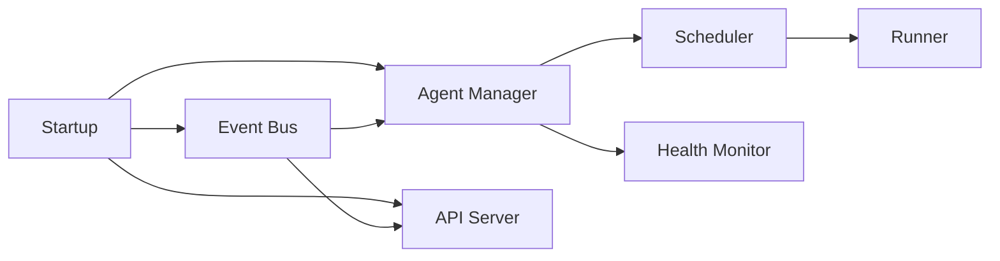

[See docs/DISCLAIMER_SNIPPET.md](../docs/DISCLAIMER_SNIPPET.md)

# Orchestrator Architecture

This short overview explains the main components of the Alpha‑Factory orchestrator.
It complements the existing design notes and helps new contributors quickly
understand how the pieces fit together.

## Component Breakdown

- **Agent Manager** – Discovers agents and loads them from the hot directory.
  It verifies ED25519 signatures when `AGENT_WHEEL_PUBKEY` is set and keeps a
  registry of active instances.
- **Scheduler** – Maintains the cycle timer and decides when each agent should
  run based on its heartbeat and configured delay.
- **Runner** – Invokes `run_cycle()` on agents and catches exceptions so the
  orchestrator never crashes on a single failure.
- **Health Monitor** – Tracks heartbeats and restarts stuck agents when the
  consecutive error threshold is exceeded. A quarantined agent can be replaced by
  a stub implementation.
- **API Server** – Exposes REST/gRPC endpoints for controlling the orchestrator
  and streaming metrics. The FastAPI service runs on its own asyncio task so it
  remains responsive while agents execute.
- **Event Bus** – Lightweight publish/subscribe layer used by the API and agents
  to exchange envelopes. All bus events are recorded in a ledger for replay.

Each component can be started or stopped independently, enabling modular
extensions such as Kafka integration or alternate runtimes. The orchestrator
itself is intentionally small so that failures in optional subsystems do not
bring down the entire process.

## Related Files

- [`alpha_factory_v1/backend/orchestrator.py`](../alpha_factory_v1/backend/orchestrator.py)
- [`alpha_factory_v1/backend/agent_manager.py`](../alpha_factory_v1/backend/agent_manager.py)
- [`alpha_factory_v1/backend/agent_runner.py`](../alpha_factory_v1/backend/agent_runner.py)
- [`alpha_factory_v1/backend/agent_supervisor.py`](../alpha_factory_v1/backend/agent_supervisor.py)

These modules implement the core logic and are heavily unit tested. Refer to
`tests/test_orchestrator.py` and related files for examples of how the
components interact in practice.
