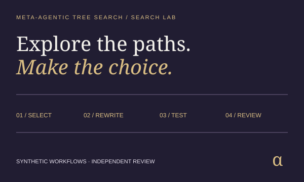
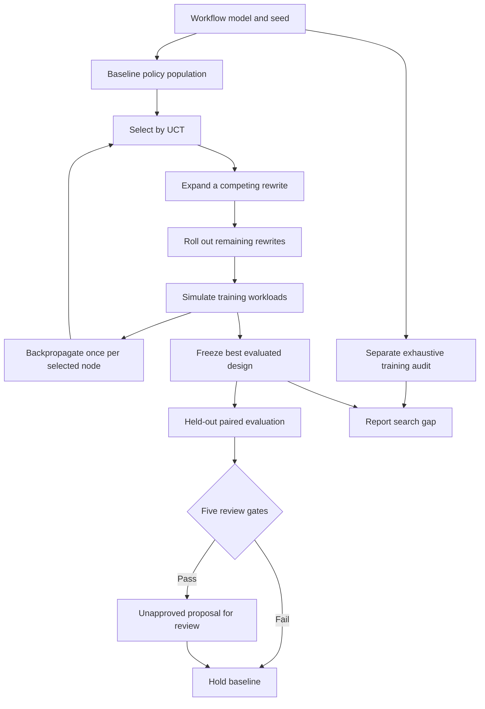

[See docs/DISCLAIMER_SNIPPET.md](../DISCLAIMER_SNIPPET.md)

# Meta-Agentic Tree Search · Search Lab

{.demo-preview}

[Launch Demo](../meta_agentic_tree_search_v0/index.html){.md-button}

**Explore competing rewrites. Inspect the search. Challenge the chosen design.**

MATS searches a bounded population of workflow policies. Named specialist operators rewrite one
stage's policy at a time. Selection, expansion, random rollout and backpropagation build a real
branching tree. Separate workloads test the frozen candidate, and an optional exhaustive audit
shows the gap to the best design in the supplied training model.

[Open the Search Lab](https://montrealai.github.io/AGI-Alpha-Agent-v0/meta_agentic_tree_search_v0/) ·
[Operating guide](https://github.com/MontrealAI/AGI-Alpha-Agent-v0/blob/main/docs/agent/MATS.md) ·
[Original research and diagrams](https://github.com/MontrealAI/AGI-Alpha-Agent-v0/blob/main/alpha_factory_v1/demos/meta_agentic_tree_search_v0/RESEARCH_ARCHIVE.md) ·
[Notebook](https://github.com/MontrealAI/AGI-Alpha-Agent-v0/blob/main/alpha_factory_v1/demos/meta_agentic_tree_search_v0/colab_meta_agentic_tree_search.ipynb)


<!-- CURRENT-DEMO:START -->
## Current runnable path — 1.17.0

**Mode: Offline search lab.** Python 3.11–3.13; the supported lab uses only the standard library.
No API key, paid provider, GPU, Docker service or runtime download is required after obtaining the source.
From the repository root:

```bash
python -m alpha_factory_v1.demos.meta_agentic_tree_search_v0 --list
python -m alpha_factory_v1.demos.meta_agentic_tree_search_v0 --case release-design --output search-runs
python -m alpha_factory_v1.demos.meta_agentic_tree_search_v0 --serve
```

Open **http://127.0.0.1:7862/meta_agentic_tree_search_v0/**. Stop with Ctrl+C; use `--port 7863` if occupied.
The installed command is `mats-lab`. The demo catalog runs the same supported workflow:

```bash
python -m alpha_factory_v1.demos run meta_agentic_tree_search_v0
```

Expected: a 120-iteration branching search, 80 paired held-out workloads, five review gates,
and six evidence files in a SHA-256-named directory. The bundled release case passes its model gates;
the proposal remains **unapproved** and the active workflow remains the baseline.

**Scope:** optimization of supplied synthetic workflow models. This is not customer-work execution,
language-model training, authenticated validator approval, live trading or a transaction submission.
<!-- CURRENT-DEMO:END -->

## First five minutes

1. Run **Design a reliable software release**. Compare candidate and baseline time, cost and escaped defects.
2. Move the iteration slider. Each highlight is an actual selected route; inspect node statistics and rollout choices.
3. Try **Plan a compatible API migration**. Its bounded search can miss the exhaustive training optimum; the gap is shown.
4. Try **Expose the unchecked-shortcut trap**. With no defect penalty, cheap shortcuts win the objective but fail review.
5. Download the review bundle, import `run.json`, and verify it independently:

```bash
python -m alpha_factory_v1.demos.meta_agentic_tree_search_v0 --verify search-runs/<run-sha256>/run.json
```

Replace `<run-sha256>` with the directory printed by your command. Imports accept scenario or complete run
JSON up to 1 MB. They reject duplicate keys, unknown fields, non-finite numbers, invalid UTF-8, excessive
nesting and altered results. Recalculating a forged report's checksum does not bypass recomputation.

## What is implemented



Each policy is a vector of choice indices, one per stage. A meta-agent is a **named bounded rewrite
operator**, not an independently running language model: it changes one stage's choice. The tree can
revisit a design through different paths, but a path cannot repeat an ancestor design. Training outcomes
are cached by complete policy; the report distinguishes iterations, unique evaluations and workload count.

Selection expands untried rewrites before comparing fully expanded branches. Its UCT value is the mean
normalized rollout utility plus an exploration bonus. Both engines use a checked-in natural-log table,
integer square root and one-millionth fixed-point arithmetic, with stable insertion-order ties. This is
a quantized UCT implementation, not a claim of exact real-arithmetic UCB confidence intervals.

A rollout randomly completes the remaining rewrite depth. Its score is added **once** to each selected
node. The candidate is the best evaluated complete rollout or baseline by training utility, with
lexicographic policy-order ties. It is not chosen by an internal-node average, the oracle or held-out results.
The tree visualization is the expanded tree; rollout-only designs appear in the iteration trace.

The exhaustive oracle evaluates every complete design in the same training model. It runs **after
candidate selection**, never feeds back into search, and has a separately reported compute cost. Its
optimum is over the supplied finite model and training samples, not the real world. Turn it off to run
only bounded search and held-out evaluation.

## The workflow simulator

Stages must appear in topological order. Each stage reserves the earliest available lane in its declared
resource pool, after its dependencies finish. Among equally available lanes, the earlier lane wins.
Durations vary from 80% through 120% of the supplied minutes and round upward. Declaration order is the
scheduler's priority order; the search rewrites stage choices, not task order or pool capacity.

Each stage can introduce a modeled defect. Defects propagate through dependencies. A successful detection
repairs the current stage's incoming or newly introduced fault and doubles that stage's duration, cost
and reviewer effort. A defect remaining in any terminal stage counts as an escaped workload defect.
This simplified model assumes perfect repair after detection; independent branch failures are Boolean,
not an additive count of individual defects. These assumptions must be replaced and measured before deployment.

Utility per workload is:

```text
value − costWeight × totalCost − timeWeight × makespan − escapePenalty × escapedDefect
```

Training and evaluation use separate xorshift32 streams, initialized from the chosen seed XOR
`0x9E3779B9` and `0xA341316C`. Each stage consumes three draws: duration multiplier, defect and detection.
Baseline and candidate receive the same held-out draws. Evaluation never changes tree statistics or selection.

## Cases and review gates

| Case | Decision | Bundled result |
|---|---|---|
| `release-design` | Balance implementation, regression, review and packaging | Independent review required |
| `api-migration` | Coordinate client/server checks with one shared engineering lane | Review required; nonzero search gap |
| `data-pipeline` | Plan validation and reproducibility work for public data | Independent review required |
| `proxy-trap` | Detect an objective that rewards unchecked shortcuts | Hold baseline: defect ceiling fails |

| Gate | Comparison |
|---|---|
| Held-out gain | Candidate total utility − baseline total utility ≥ minimum gain × workload count |
| Escaped defects | Candidate escapes × 10,000 ≤ configured basis-point ceiling × workload count |
| Delivery | Nearest-rank 95th-percentile candidate makespan ≤ deadline |
| Resource cost | Candidate total cost ≤ mean-cost ceiling × workload count |
| Reviewer effort | Candidate total reviewer minutes ≤ effort ceiling × workload count |

The comparisons use integers. Display rounding cannot change a gate. Gates are checks on a finite simulation,
not statistical confidence bounds. Do not tune a model or seed after viewing evaluation and call the result
independent. A real reviewer needs fresh workloads, representative measurements and authenticated authority.

Limits: 2–6 stages, 2–4 choices per stage, 1–4 resource pools with 1–4 lanes, at most 1,024 complete designs,
1–240 search iterations, rewrite depth 1–6, 4–64 training workloads and 20–128 held-out workloads.

## Evidence and the Ascension vision

Each immutable export contains `scenario.json`, `run.json`, `policy-proposal.json`, `jobs.json`, `review.md`
and `SHA256SUMS`. Existing identical exports are reusable; altered or incomplete directories are rejected.
Use a fresh output directory after an interrupted or modified export. Hashes establish byte identity, not authorship.

The proposal preserves the active baseline. Its input-bound review job carries a goal, success metric and
$AGIALPHA-denominated bounty and compiles through the repository's existing Ascension planner. It remains
**unsubmitted and unfunded**. The lab does not mint Nova-Seeds, clear MARK markets, authenticate ENS identities,
collect validator signatures, transfer funds or activate a Sovereign enterprise. Those require the corresponding
protocol and deployment components; the search output is reviewable planning evidence for that workflow.

## Preserved research and compatibility

The [complete original README](https://github.com/MontrealAI/AGI-Alpha-Agent-v0/blob/main/alpha_factory_v1/demos/meta_agentic_tree_search_v0/RESEARCH_ARCHIVE.md), its diagrams and aspirational narrative,
[original notebook](https://github.com/MontrealAI/AGI-Alpha-Agent-v0/blob/main/alpha_factory_v1/demos/meta_agentic_tree_search_v0/research_notebook_archive.ipynb), browser replay, configuration, package exports,
`mats-demo` and `mats-bridge` remain available. The archived narrative is historical, not a list of implemented features.
In particular, the original PPO, 3.1% IRR, RiskGovernor, Firejail and distributed-worker claims were not
implemented by the integer demo. The supported lab does not repeat those claims.

The integer example now branches, accumulates rewards once, returns an actual visited leaf, writes valid
quoted CSV, validates finite inputs and uses a private seeded RNG. Run it explicitly:

```bash
mats-demo --episodes 30 --seed 42 --rewriter random
mats-bridge --episodes 3 --target 4 --rewriter random
```

Optional OpenAI/Anthropic rewrites are bounded synchronous calls with a 15-second timeout and no retries.
They fall back visibly to integer mutation when unavailable; `NO_LLM=1` disables provider use. The optional
Agents SDK coordinator lazily imports the installed SDK, binds the requested parameters and permits at
most three turns. Model names and account access are deployment settings; provide a currently available
model with `--model` or the documented environment variables. Live provider and ADK operation require
separate account/environment validation and are outside the fully offline lab acceptance profile.

`LiveBrokerEnv` is an integer-target replay stub, not a brokerage connector. The supported lab never
loads provider credentials or makes model calls.

## References

- [Zhou et al., Language Agent Tree Search (ICML 2024)](https://arxiv.org/abs/2310.04406).
  This work is related context, not a claim that this bounded planner reproduces LATS benchmarks.
- [OpenAI Agents SDK configuration](https://openai.github.io/openai-agents-python/config/).
- [Release acceptance and deployment evidence](https://github.com/MontrealAI/AGI-Alpha-Agent-v0/blob/main/docs/agent/RELEASE_READINESS.md).

Apache-2.0. Existing source-file license notices are preserved.

[View README on GitHub](https://github.com/MontrealAI/AGI-Alpha-Agent-v0/blob/main/alpha_factory_v1/demos/meta_agentic_tree_search_v0/README.md)
