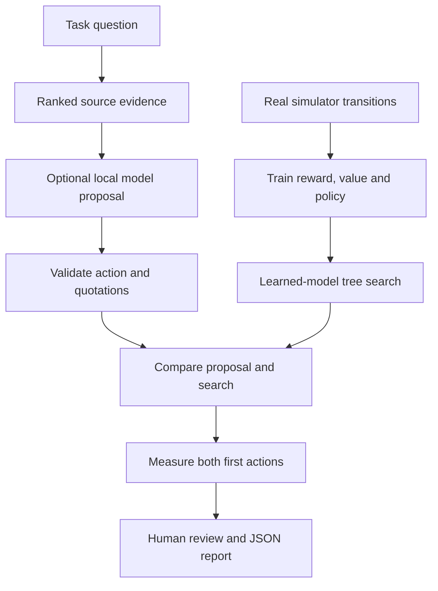

[See docs/DISCLAIMER_SNIPPET.md](../DISCLAIMER_SNIPPET.md)

# MuZero × MCTS × LLM · Evidence & Planning Lab

{.demo-preview}

[Launch Demo](../muzeromctsllmagent_v0/index.html){.md-button}

**Retrieve evidence. Propose an action. Train a model. Measure the result.**

A runnable, local integration of cited task evidence, optional Ollama advice and
learned-model Monte Carlo tree search. Start without an API key or language model.
The supported task is deliberately small: take **0.3 now**, or learn a two-step
route to **1.0 later**. All outcomes are simulator rewards, not money.

<!-- CURRENT-DEMO:START -->
## Start in three steps — 1.24.0

From a source checkout on **Linux x86_64**, with **Python 3.11–3.13**:

```bash
bash alpha_factory_v1/demos/muzeromctsllmagent_v0/install_and_launch.sh
```

1. The launcher installs the shared, hash-locked CPU profile into `.venv-mcts-llm`
   in the repository. The first install needs internet and space for PyTorch.
2. Open **http://127.0.0.1:7862**. Select **Retrieve, train & compare**.
3. Inspect retrieved evidence, visits, predicted values and actual action traces.
   Select **Download JSON report**, or copy the complete record, to review the experiment.

Stop training with **Stop**; stop the server with **Ctrl+C**. An active local
model request may take up to its 60-second network timeout. The server binds only
loopback, has no public tunnel and makes no inference request unless a model is
explicitly selected. Run one lab process at a time in a given Python process.

The installer does not create `agent.py`, `requirements.txt` or a Dockerfile in
some other project. It retains and reuses its dedicated environment. Run
`install_and_launch.sh --help` without installing anything.

For an already provisioned Linux environment or Windows development:

```bash
python -m pip install -r alpha_factory_v1/demos/muzero_planning/requirements.txt
python -m alpha_factory_v1.demos.muzeromctsllmagent_v0
```

For **Apple silicon on macOS 14 or later**, create and activate a Python 3.11–3.13
virtual environment, then use the macOS profile (PyTorch's macOS wheel does not
use the `+cpu` suffix):

```bash
python3 -m venv .venv-mcts-llm
source .venv-mcts-llm/bin/activate
python -m pip install -r alpha_factory_v1/demos/muzeromctsllmagent_v0/requirements-macos.txt
python -m alpha_factory_v1.demos.muzeromctsllmagent_v0
```

These development requirements are pinned at the top level; the fully hashed
lock and release acceptance cover Linux x86_64. Native Windows/macOS training and
browser validation remain required before claiming those platforms are supported
for deployment. Intel Macs need a separately validated PyTorch build; see
[PyTorch installation](https://pytorch.org/get-started/locally/).
Python `--help` does not import PyTorch.

<!-- CURRENT-DEMO:END -->

## A repeatable command-line experiment

```bash
python -m alpha_factory_v1.demos.muzeromctsllmagent_v0 \
  --headless --episodes 32 --simulations 32 --seed 42 --output experiment.json
```

The command exits after a bounded run and refuses to overwrite `experiment.json`.
Reports include evidence text and SHA-256 hashes, model mode, validated quotations,
training losses, four evaluation baselines, root-search statistics, actual
counterfactual traces, package versions, demo version, hashes of the actual planning
source files and portable neural weights. Source hashes identify code bytes;
they do not authenticate who supplied them. Set
`--episodes 0` to inspect untrained behavior. No improvement is fabricated if
training fails to find the better action.

## Add a real local model

Install and run [Ollama](https://docs.ollama.com/), then explicitly install a model
that fits your hardware. Enter its installed name in the UI, or pass
`--model YOUR_INSTALLED_MODEL` to the command above. Nothing downloads a model for
you. Requests use Ollama's `/api/chat` endpoint with a JSON schema, bounded output,
no redirects and no environment proxies, at `127.0.0.1:11434` only.

The question and retrieved task evidence are sent to that local service. The
returned action must be 0 or 1; every quotation must occur in its cited source.
Malformed responses, unavailable models and fabricated citations fail the run
visibly. There is no pretend LLM fallback. **Quotation validity does not prove
reasoning correctness.** Search remains the decision maker; model agreement and
both candidate outcomes are shown for human review.

## Understand the experiment



Retrieval is transparent lexical overlap over four source-linked task facts;
zero-overlap facts remain labeled context. This is a complete tiny corpus, not
web research or semantic retrieval. MuZero search uses learned latent dynamics;
it does not consult real environment transitions inside the tree. Each candidate
first action is then tested separately in the simulator with the same reset seed
and trained continuation. Predicted Q and observed return are different quantities.

Random, untrained search, trained policy and trained search are evaluated on the
same reset seeds. MiniChoice is deterministic: repeated seeds test behavior,
**not generalization**. The model is retrained from scratch each run. For harder
Gymnasium experiments, see [MuZero Planning Lab](https://github.com/MontrealAI/AGI-Alpha-Agent-v0/blob/main/alpha_factory_v1/demos/muzero_planning/README.md).

## Troubleshooting

| Symptom | Action |
|---|---|
| Missing torch, gymnasium or Gradio | Use the dedicated launcher or install the shared requirements. |
| Port 7862 already occupied | Stop the other instance or pass `--port 7863`. |
| Ollama request fails | Confirm the service is running and the model is installed; clear the model field for offline mode. |
| Model produces invalid citations | Retry with a suitable model; invalid advice is never silently accepted. |
| No training improvement | Inspect losses, visits and baselines; try the default 32 episodes and seed 42. |
| Output already exists | Choose a new filename; existing reports are preserved. |
| Run failed in the dashboard | The previous report is cleared and download is disabled. Correct the input or model, then run again. |

## Scope and preserved research

This is an educational integration, not a production trading service, autonomous
enterprise, achieved AGI, or reproduction of published MuZero benchmark results.
No wallet signature, balance check, token transfer, settlement, validator network
or external action is performed. Deployment with real funds or multi-user access
requires a separately validated authentication, authorization and execution layer.

The [original presentation](https://github.com/MontrealAI/AGI-Alpha-Agent-v0/blob/main/alpha_factory_v1/demos/muzeromctsllmagent_v0/muzeromctsllmagentv0.html), original imagery and
[original research/installer archive](https://github.com/MontrealAI/AGI-Alpha-Agent-v0/blob/main/alpha_factory_v1/demos/muzeromctsllmagent_v0/archive/README.original.md) are retained.
The archive manifest records source hashes and the source commit. Its installer
is inert text because it generated placeholder planning code and overwrote caller
files. Embedded provider credentials were redacted from retained copies; this
does not rotate credentials already present in Git history. The original
browser balance check was not proof of wallet ownership or server authorization.
Do not use that historical illustration as an access-control system.

[View README on GitHub](https://github.com/MontrealAI/AGI-Alpha-Agent-v0/blob/main/alpha_factory_v1/demos/muzeromctsllmagent_v0/README.md)
