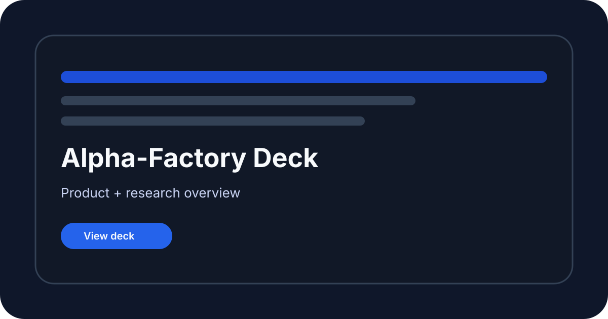

[See docs/DISCLAIMER_SNIPPET.md](../DISCLAIMER_SNIPPET.md)

# Demo Presentation Assets

{.demo-preview}
<!-- CURRENT-DEMO:START -->
## Current runnable path — 1.4.0

**Mode:** Reference. Preserved slide deck and PDF for the original demo vision.

**Prerequisites:** A PDF or PowerPoint viewer.

From the repository root after [installation](https://github.com/MontrealAI/AGI-Alpha-Agent-v0/blob/main/alpha_factory_v1/demos/README.md#start-locally):

```bash
python -m alpha_factory_v1.demos show presentation
```

**Expected result:** Open the PDF or PPTX linked in this directory.

**Scope:** Slides describe the original vision; use this catalog for tested behavior.

The [catalog](https://github.com/MontrealAI/AGI-Alpha-Agent-v0/blob/main/alpha_factory_v1/demos/README.md) explains installation, stopping, backups and recovery.
Browser charts for legacy demos are labeled sample replays. Original research
narratives and advanced scripts below are preserved; they do not expand the tested
scope stated here.
<!-- CURRENT-DEMO:END -->

This repository is a conceptual research prototype. References to "AGI" and "superintelligence" describe aspirational goals and do not indicate the presence of a real general intelligence. Use at your own risk. Nothing herein constitutes financial advice. MontrealAI and the maintainers accept no liability for losses incurred from using this software.


This folder collects the slide deck and PDF used to present the Alpha-Factory demo portfolio.
The assets are provided for reference when reviewing or showcasing the demos.

## Included files

- `AGI-Alpha-Agent-v0_Demos_Master_v0.pptx`
- `AGI-Alpha-Agent-v0_Demos_Master_v0.pdf`

## Quick view

```bash
xdg-open AGI-Alpha-Agent-v0_Demos_Master_v0.pdf
```

[View README on GitHub](https://github.com/MontrealAI/AGI-Alpha-Agent-v0/blob/main/alpha_factory_v1/demos/presentation/README.md)
