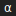

{.demo-preview}

# Self-Healing Repo / Repo-Healer v1

Repo-Healer v1 now targets this repository with structured CI failure bundles and bounded local validation.
The previous toy-only flow is retained as a UI demo wrapper, not the production path.

## Capability matrix

### Tier 1 (auto-patch)
- Ruff lint failures
- Mypy failures
- Broken imports/simple Python config regressions
- Linux-reproducible pytest/smoke failures
- MkDocs/docs failures reproducible locally

### Tier 2 (diagnose + suggestion/draft only)
- GitHub workflow/actionlint failures
- Docker build failures
- Windows/macOS-only failures

### Tier 3 (refused)
- Secrets/tokens/credentials/signing/release publishing
- Branch-protection weakening or CI bypass edits
- Any unsafe protected-surface patch

## Structured inputs

Repo-Healer consumes a normalized failure bundle containing workflow/job/step metadata,
exit code, annotations, artifacts, logs, and optional JUnit XML path.

## CI integration

Workflow: `.github/workflows/repo-healer.yml`

- Triggered from real failed workflow runs.
- Uses `run_attempt >= 2` gating so CI Health reruns get first chance to clear flakes.
- Produces reusable artifacts:
  - `repo_healer_bundle.json`
  - `repo_healer_candidates.json`
  - `repo_healer_report.json`
- Executes bounded engine dry-run in CI; local/manual runs can execute apply mode.

## Local replay

```bash
python -m alpha_factory_v1.demos.self_healing_repo.repo_healer_v1.cli \
  --repo . \
  --failure-bundle repo_healer_bundle.json \
  --candidates repo_healer_candidates.json \
  --report repo_healer_report.json \
  --dry-run
```

## Seeded benchmark

```bash
python -m alpha_factory_v1.demos.self_healing_repo.repo_healer_v1.benchmark \
  --repo . \
  --out repo_healer_benchmark.json
```

The benchmark runs from a clean temporary copy and reports machine-readable baseline vs healed outcomes.
