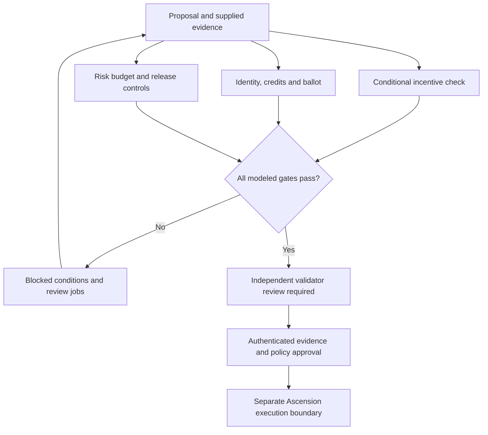

[See docs/DISCLAIMER_SNIPPET.md](../DISCLAIMER_SNIPPET.md)

# Solving α-AGI Governance · Governance Workbench

{.demo-preview}

[Launch Demo](../solving_agi_governance/index.html){.md-button}

**Review the rules before an autonomous enterprise acts.** Inspect incentive compatibility,
validator independence, quadratic ballots, aggregate risk and upgrade controls. Leave with
a reproducible review and nine measurable, unsubmitted $AGIALPHA verification jobs.

[Open the workbench](https://montrealai.github.io/AGI-Alpha-Agent-v0/solving_agi_governance/)
· [Open the notebook](https://colab.research.google.com/github/MontrealAI/AGI-Alpha-Agent-v0/blob/main/alpha_factory_v1/demos/solving_agi_governance/colab_solving_agi_governance.ipynb)
· [Original research archive](https://github.com/MontrealAI/AGI-Alpha-Agent-v0/blob/main/alpha_factory_v1/demos/solving_agi_governance/RESEARCH_ARCHIVE.md)

<!-- CURRENT-DEMO:START -->
## Current runnable path — 1.23.3

**Mode:** Offline governance review. Evaluates nine proposal gates and exports reproducible evidence and Ascension job specifications.

**Prerequisites:** Python 3.11–3.13. The workbench uses only the standard library; no wallet, API key, provider or database is needed.

From a source checkout:

```bash
python -m alpha_factory_v1.demos check solving_agi_governance
python -m alpha_factory_v1.demos run solving_agi_governance --output-dir governance-runs
```

**Expected result:** `REVIEW_REQUIRED` for the constructed accountable-upgrade case; five evidence files in a content-addressed directory.

**Scope:** The calculation does not authenticate identities or votes, calibrate risk estimates, prove universal convergence, approve an upgrade or move tokens. All jobs remain unsubmitted.
<!-- CURRENT-DEMO:END -->

## A three-minute first run

1. Open the browser workbench and select **Accountable upgrade**.
2. Inspect the assumptions and roster, then **Evaluate all nine gates**. All nine modeled checks pass; independent review remains required.
3. Try **A majority with a shared controller**. The identity gate blocks it even though the vote totals are unchanged.
4. Download the ZIP. It contains the complete inputs, outputs, job specifications, review brief and SHA-256 checksums.
5. Import `dossier.json` to recompute every decision, or verify it with Python. Changing any input invalidates the current result and disables exports.

Nothing is uploaded. Browser draft storage is explicit: **Save draft**, **Restore draft**,
and **Clear saved draft** affect this browser only. A ZIP is the portable backup.
After a complete first load, the service worker supports offline recalculation. The
original replay's optional OpenAI mode is a separate, explicit network action.

## What the gates establish



| Gate | Exact modeled check | What still needs external evidence |
|---|---|---|
| Identity | At least one eligible, staked validator; no repeated controlling principal | ENS ownership, complete roster and actual independence |
| Credits | Each eligible ballot costs votes², within its credits | Legitimate credit issuance, authenticated ballot signatures |
| Quorum | Valid nonzero ballots / eligible validators meets the threshold | A complete, frozen electorate snapshot |
| Mandate | Strict positive majority and declared support percentage | Proposal-bound signed vote records |
| Incentives | Cooperative reward ≥ normalized one-shot deviation return | Payoffs, monitoring, enforceable slashing and credible punishment |
| Risk | `min(1, N × p)` ≤ total risk budget | Calibrated upper bounds for the actual action envelope |
| Timelock | Explicit scenario time ≥ queue time + delay; minimum seven days | Authoritative chain timestamps and governance delay |
| Policy | Proposed and expected policy SHA-256 commitments match | Exact policy bytes and independent authorization |
| Pause | Supplied emergency pause is inactive | Authoritative stop state; tested rollback and recovery |

A `PASS / MODEL` is conditional arithmetic. A proposal becomes `REVIEW_REQUIRED`
only when all nine gates pass; otherwise it is `BLOCKED`. There is deliberately no
`APPROVED` or `EXECUTED` result. A correctly calculated blocked case is a successful
CLI run, so the process exits 0; invalid input or an altered dossier exits 2.

## Run and verify locally

```bash
python -m alpha_factory_v1.demos.solving_agi_governance --list
python -m alpha_factory_v1.demos.solving_agi_governance --case scale-risk --output governance-runs
python -m alpha_factory_v1.demos.solving_agi_governance --input scenario.json --output governance-runs
python -m alpha_factory_v1.demos.solving_agi_governance --verify governance-runs/<sha256>/dossier.json
```

Replace `<sha256>` with the directory printed by the run. The `governance-workbench`
console command is equivalent after installing the project. `--json` prints the
complete dossier. Verification is read-only and never fetches a source URL.

| Constructed case | Expected result |
|---|---|
| `accountable-upgrade` | Nine modeled passes; independent review required |
| `captured-ballot` | Identity blocked: two named validators share a controller |
| `weak-deterrence` | Incentives blocked: the one-shot deviation still pays |
| `scale-risk` | Risk blocked: 10¹² actions at 10⁻⁹ per action exceed the budget |
| `paused-upgrade` | Timelock, policy commitment and emergency-stop gates blocked |

Every bundle contains:

- `scenario.json`: the normalized, complete input, including the supplied clock and source note.
- `dossier.json`: all gate decisions, exact arithmetic and a SHA-256 commitment.
- `review-brief.md`: readable findings, assumptions and next steps.
- `jobs.json`: nine goal ↔ success metric ↔ bounty specifications accepted by `ascension-compile`.
- `SHA256SUMS`: checksums for those four files.

Python and browser outputs must match byte for byte. The hash is an integrity
commitment, not a signature or proof that supplied assumptions are true. A dossier
import recomputes the entire report, including its jobs; changing the status and
rehashing the file cannot turn a blocked case into an approved one.

## The calculations

### Conditional cooperation

Let `R` be the cooperative reward, `T` the one-shot temptation, `P` the subsequent
punishment payoff, `q` the probability of detecting a unilateral deviation, `s` its
slashable stake in the same utility units, and `δ < 1` the future discount factor.

The cooperative path has value `R / (1−δ)`. With probability `q`, a one-shot deviation
is detected, incurs a single slash and triggers punishment. Otherwise, the deviator
returns to the cooperative path. Its expected value is
`T−q·s + δ[qP+(1−q)R] / (1−δ)`. The workbench checks:

```text
R ≥ (1−δ)(T−q·s) + δ[qP+(1−q)R]
```

This assumes infinite repeated play, stationary payoffs and public detection probability,
risk-neutral agents, no false positives and credible grim-trigger punishment after detection.
Punishment-path credibility is assumed, not proved. Private signals, false positives, collusion,
forgiveness, finite horizons and competing strategies require additional models.
Passing this inequality establishes neither a unique equilibrium nor antifragility.

At `q = 0`, a profitable deviation cannot be deterred by patience or an unenforceable
stake. At `q = 1`, the condition reduces to `R ≥ (1−δ)(T−s) + δP`.

Basis-point inputs and integer payoffs make the reported margin exact. The browser
uses `BigInt` where products exceed safe numeric precision. The chart changes δ
while holding other assumptions fixed; its 100% endpoint is a limit, not an allowed
input for the infinite-horizon value formula.

### Risk at scale

For `N` actions, each bounded by failure probability `p`, the union bound is
`min(1, Np)`. No independence assumption is needed. The sum of expected failures is
bounded by `Np`; this is not the probability of at least one failure.

At `p = 10⁻⁹` and `N = 10¹²`, the expected-count upper bound is 1,000 and the union
bound is 1. For a total budget of 0.001, require `p ≤ 10⁻¹⁵`. Input probabilities
use integer femto units (10⁻¹⁵); the admissible per-action bound is rounded down,
and inputs that cannot be represented exactly are rejected rather than rounded.

The original paper's Table 4 is a separate normalized score. Its stated formula
produces **0.393045**, exceeding 0.3, rather than the printed 0.215. It cannot be
substituted for a catastrophe probability. The existing
[Governance Observatory](https://montrealai.github.io/AGI-Alpha-Agent-v0/ascension/#governance)
retains the table audit, Hawk–Dove dynamics, counterexamples and further analysis.

## Fit within α-AGI Ascension

| Vision component | Implemented handoff |
|---|---|
| Insight and Nova-Seeds | Review the proposal assumptions and their content commitment before a seed or policy change |
| MARK and Sovereign businesses | Inspect risk, incentives and control gates before capital or execution decisions |
| α-AGI Jobs | Export nine input-bound verification jobs with measurable acceptance criteria and $AGIALPHA bounties |
| Agents and validators | Compile jobs for the separate protocol; validate staked agent eligibility and independent validator returns there |
| Settlement | The [Ascension protocol](https://montrealai.github.io/AGI-Alpha-Agent-v0/ascension-protocol/) demonstrates local-EVM escrow, validator-gated settlement and a 1% payout burn |

```bash
alpha-agent ascension-compile governance-runs/<sha256>/jobs.json --output fusion-plan.json
```

Compilation does not post a job, escrow a reward or authorize execution. Review the
[protocol guide](https://github.com/MontrealAI/AGI-Alpha-Agent-v0/blob/main/docs/agent/ASCENSION_PROTOCOL.md) before using its separate
local-EVM workflow. Utility stake in the incentive model and AGIALPHA validator/job
balances have different units; no exchange rate is assumed.

## Original simulator and optional integrations

The original command remains available, with its valid seeded numerical behavior preserved:

```bash
python -m alpha_factory_v1.demos.solving_agi_governance.governance_sim --agents 100 --rounds 1000 --delta 0.8 --stake 2.5 --seed 42
```

Here `--delta` is a **numerical update rate**, not the repeated-game discount factor.
Randomness initializes the population; subsequent mean-field updates are deterministic.
There is no universal δ = 0.8 transition. Negative, non-finite and unbounded work
requests now fail clearly. Runs are limited to 100 million agent updates.

`--summary` explicitly opts into the optional OpenAI Python client when credentials
are configured. It is a language summary, not part of the decision calculation.
The default run is entirely local. The legacy `governance-bridge` command uses the
repository's runtime compatibility interface; its presence does not prove a live
OpenAI Agents service. Without the interface, or with `OPENAI_AGENTS_DISABLE=1`,
it runs locally and accepts `--seed`. ADK exposure remains opt-in.

## Recovery and input limits

- Imports are UTF-8 JSON, at most 256 KB, with 1–64 validator records. Unknown keys, duplicate keys, invalid Unicode, non-finite numbers, excessive nesting and out-of-range values are rejected.
- The maintained model is finite and bounded. No imported text is executed or rendered as HTML, and no URL in an input is fetched.
- Scenario edits invalidate exports. Apply edited advanced JSON before evaluating or saving.
- Python output is content-addressed. An unchanged rerun reuses an exact bundle; altered, partial or symlinked runs are refused. Preserve them and select a new `--output` directory.
- If browser draft storage is unavailable, use JSON or ZIP exports. If assets are unavailable on a first offline visit, load once online or run Python from an existing checkout.

## Research collection — preserved

Vincent Boucher's original materials remain available, including every original diagram:

- [Manuscript PDF](https://github.com/MontrealAI/AGI-Alpha-Agent-v0/blob/main/alpha_factory_v1/demos/solving_agi_governance/alpha_asi_governance_v13.pdf) and [TeX source](https://github.com/MontrealAI/AGI-Alpha-Agent-v0/blob/main/alpha_factory_v1/demos/solving_agi_governance/alpha_asi_governance_v13.tex).
- [Presentation PDF](https://github.com/MontrealAI/AGI-Alpha-Agent-v0/blob/main/alpha_factory_v1/demos/solving_agi_governance/presentation/Solving_Alpha-AGI_Governance_v0.pdf) and [editable PowerPoint](https://github.com/MontrealAI/AGI-Alpha-Agent-v0/blob/main/alpha_factory_v1/demos/solving_agi_governance/presentation/Solving_Alpha-AGI_Governance_v0.pptx).
- [Original README, unchanged](https://github.com/MontrealAI/AGI-Alpha-Agent-v0/blob/main/alpha_factory_v1/demos/solving_agi_governance/RESEARCH_ARCHIVE.md) and [original notebook archive](https://github.com/MontrealAI/AGI-Alpha-Agent-v0/blob/main/alpha_factory_v1/demos/solving_agi_governance/research_notebook_archive.ipynb).
- [Maintained notebook](https://github.com/MontrealAI/AGI-Alpha-Agent-v0/blob/main/alpha_factory_v1/demos/solving_agi_governance/colab_solving_agi_governance.ipynb), including all five cases, replay checks and the original simulator.

The archive preserves historical assertions; it is not new evidence for the claimed
unique equilibrium, six-million-round experiment, Coq certificates, Landauer-limit
behavior or guaranteed antifragility. See the
[white-paper implementation guide](https://github.com/MontrealAI/AGI-Alpha-Agent-v0/blob/main/docs/agent/WHITEPAPER_IMPLEMENTATION.md)
for the existing audit and missing evidence. The workbench makes these review
obligations explicit rather than treating aspirations as completed verification.

[View README on GitHub](https://github.com/MontrealAI/AGI-Alpha-Agent-v0/blob/main/alpha_factory_v1/demos/solving_agi_governance/README.md)
